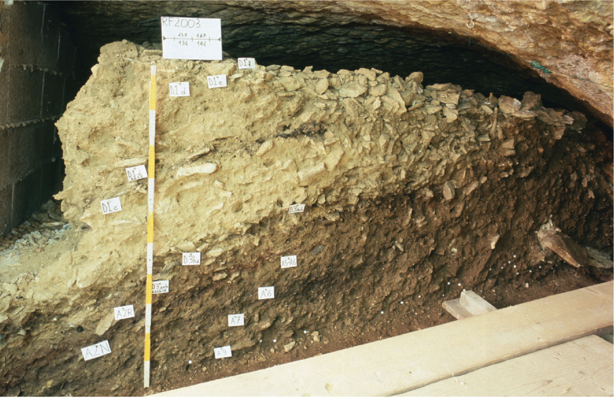
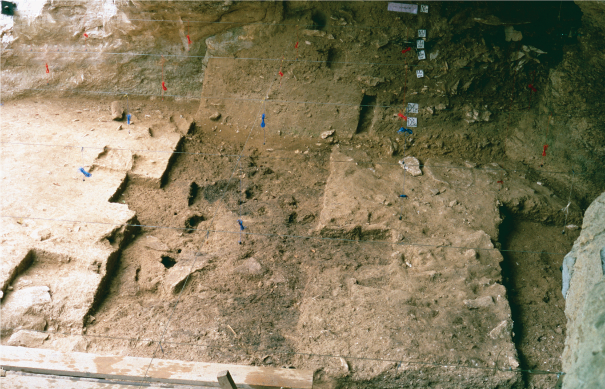
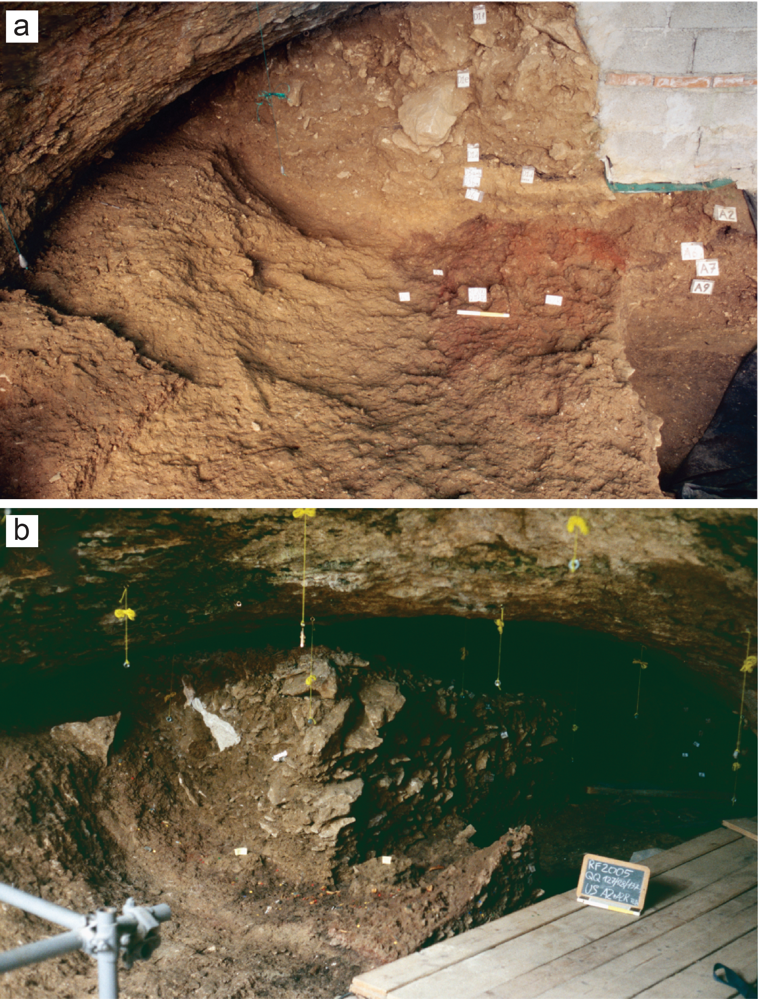
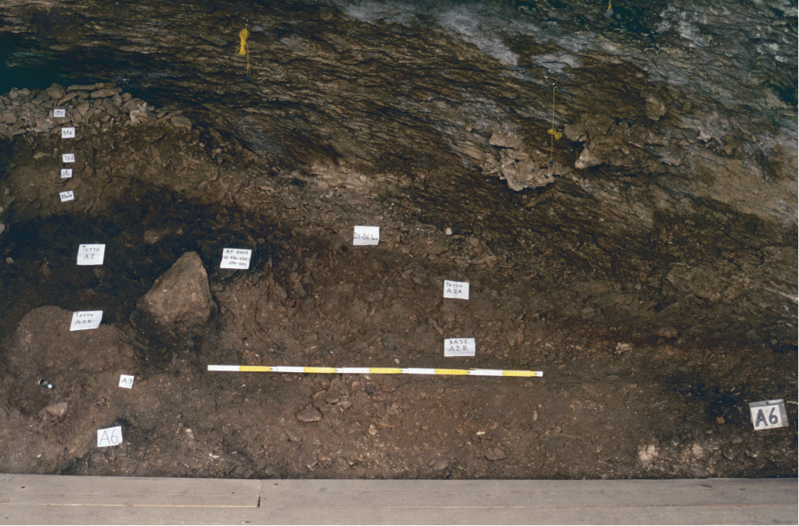
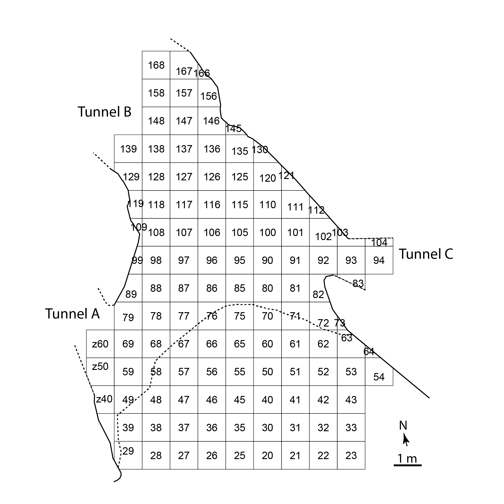
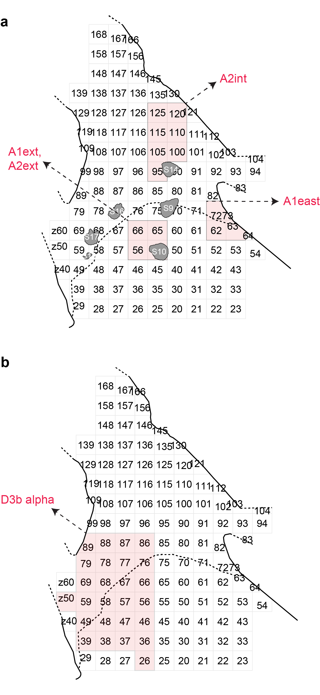
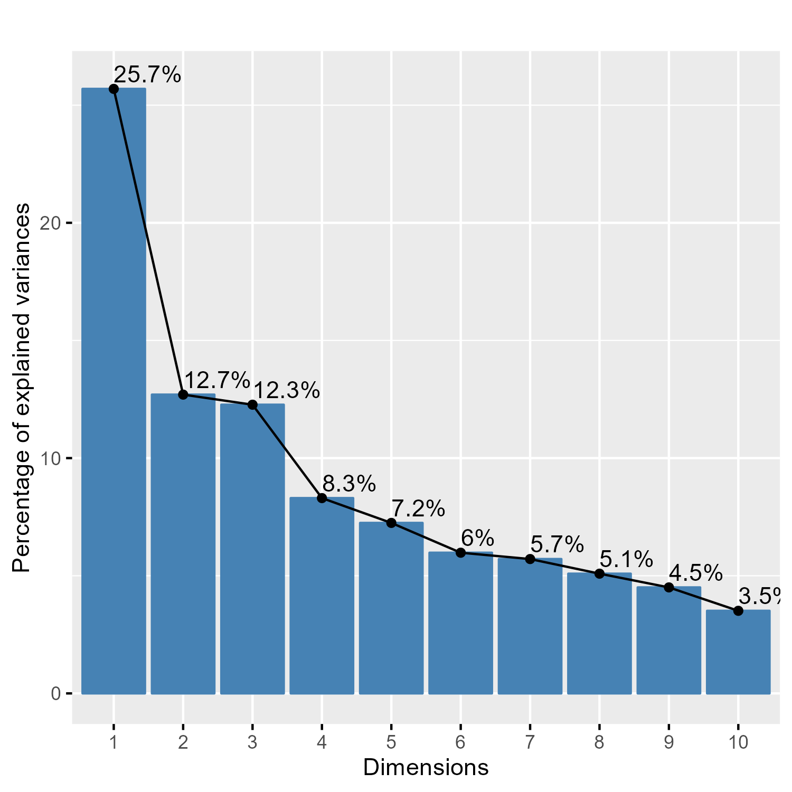

```{r setup, include=FALSE}
knitr::opts_chunk$set(echo = TRUE)
```
```{r, include=FALSE, warning=FALSE}
library(readxl)
library(tidyverse)
library(knitr)
library(kableExtra)
library(janitor)
library(rstatix)
library(MetBrewer)
library(ggpubr)
library(ggstatsplot)
```

```{r, include=FALSE, warning=FALSE}
## Selecting the blanks belonging to the areas chosen for the technological studies

# A2int ####
dataset_A2int <- read_excel("../data/RF_Dataset_Blanks.xlsx") %>%
  filter(unit == "A2") %>%
  filter(square %in% c("95", "100", "105", "110","115", "120", "125")) %>%
  rename(SU = "unit")

dataset_A2int$SU <- c("A2int")


# A2ext ####
dataset_A2ext <- read_excel("../data/RF_Dataset_Blanks.xlsx") %>%
  filter(unit == "A2") %>%
  filter(square %in% c("55","56", "65", "66")) %>%
  rename(SU = "unit")

dataset_A2ext$SU <- c("A2ext")


# A1ext ####
dataset_A1ext <- read_excel("../data/RF_Dataset_Blanks.xlsx") %>%
  filter(unit == "A1") %>%
  filter(square %in% c("55","56", "65", "66")) %>%
  rename(SU = "unit")

dataset_A1ext$SU <- c("A1ext")

# A1 east ####
dataset_A1east <- read_excel("../data/RF_Dataset_Blanks.xlsx") %>%
  filter(unit == "A1") %>%
  filter(square %in% c("62","63", "72", "73")) %>%
  rename(SU = "unit")

dataset_A1east$SU <- c("A1east")


# D3b alpha ####
dataset_D3balpha <- read_excel("../data/RF_Dataset_Blanks.xlsx") %>%
  rename(SU = "unit") %>%
  filter(SU == "D3b.alpha")

# Merging ####
dataset.blank <- rbind(dataset_A2ext, dataset_A2int, dataset_A1ext,dataset_A1east, dataset_D3balpha)

dataset.blank <- dataset.blank %>%
  mutate(SU = fct_relevel(SU, "A2int", "A2ext", "A1ext", "A1east", "D3b.alpha"))
```

```{r, include=FALSE, warning=FALSE}
## Selecting the cores belonging to the areas chosen for the technological studies

# A2int ####
dataset_core_A2int <- read_excel("../data/RF_Dataset_Cores.xlsx") %>%
  filter(unit == "A2") %>%
  filter(square %in% c("95", "100", "105", "110","115", "120", "125")) %>%
  rename(SU = "unit")

dataset_core_A2int$SU <- c("A2int")


# A2ext ####
dataset_core_A2ext <- read_excel("../data/RF_Dataset_Cores.xlsx") %>%
  filter(unit == "A2") %>%
  filter(square %in% c("55","56", "65", "66")) %>%
  rename(SU = "unit")

dataset_core_A2ext$SU <- c("A2ext")


# A1ext ####
dataset_core_A1ext <- read_excel("../data/RF_Dataset_Cores.xlsx") %>%
  filter(unit == "A1") %>%
  filter(square %in% c("55","56", "65", "66")) %>%
  rename(SU = "unit")

dataset_core_A1ext$SU <- c("A1ext")


# A1 east ####
dataset_core_A1east <- read_excel("../data/RF_Dataset_Cores.xlsx") %>%
  filter(unit == "A1") %>%
  filter(square %in% c("62","63", "72", "73")) %>%
  rename(SU = "unit")

dataset_core_A1east$SU <- c("A1east")


# D3b alpha ####
dataset_core_D3balpha <- read_excel("../data/RF_Dataset_Cores.xlsx") %>%
  rename(SU = "unit") %>%
  filter(SU == "D3b.alpha")


# Merging ####
dataset.core <- rbind(dataset_core_A2ext, dataset_core_A2int, dataset_core_A1ext,dataset_core_A1east, dataset_core_D3balpha)

dataset.core <- dataset.core %>%
  mutate(SU = fct_relevel(SU, "A2int", "A2ext", "A1ext", "A1east", "D3b.alpha"))
```

```{r, include=FALSE, warning=FALSE}
# Creating a dataset that includes all blanks and cores, as well as those fragments and flakes that were only counted and divided according to the technological category in Falcucci et al. (2017) and Falcucci et al. (2020)

dataset.fragments.flakes <- read_csv("../data/RF_Dataset_Fragments_Flakes.csv") %>%
  select(SU, class, blank, technology, preservation, cortex.y.n)

dataset.blank.reduced <- dataset.blank %>%
  select(SU, class, blank, technology, preservation, cortex.y.n)

dataset.core.reduced <- dataset.core %>%
  filter(class != "Core-Tool") %>%
  select(SU, class) %>%
  mutate(blank = NA, technology = NA, preservation = NA, cortex.y.n = NA)

dataset.complete.reduced <- rbind(dataset.fragments.flakes, dataset.blank.reduced, dataset.core.reduced)

dataset.complete.reduced <- dataset.complete.reduced %>%
  mutate(SU = fct_relevel(SU, "A2int", "A2ext", "A1ext", "A1east", "D3b.alpha"))
```

```{r, include=FALSE, warning=FALSE}
comparison <- list(c("A2int", "A2ext"), c("A2int", "A1ext"), c("A2int", "A1east"), c("A2int", "D3b.alpha"), c("A2ext", "A1ext"), c("A2ext", "A1east"), c("A2ext", "D3b.alpha"), c("A1ext", "A1east"), c("A1ext", "D3b.alpha"), c("A1east", "D3b.alpha"))

comparison_no.alpha <- list(c("A2int", "A2ext"), c("A2int", "A1ext"), c("A2int", "A1east"), c("A2ext", "A1ext"), c("A2ext", "A1east"), c("A1ext", "A1east"))

comparison_A2int.ext <- list(c("A2ext", "A2int"))

comparison.no.A1ext <- list(c("A2int", "A2ext"), c("A2int", "A1east"), c("A2int", "D3b.alpha"), c("A2ext", "A1east"), c("A2ext", "D3b.alpha"), c("A1east", "D3b.alpha"))
```

```{r, include=FALSE, warning=FALSE}
#calculation of the SDI
dataset.core <- dataset.core %>%
  mutate(SDI = scar.count.total / surface,
         logSDI = log(SDI))
```

<br>

## SM S1: The formation of the cave and its stratigraphic sequence
Fumane Cave is situated on a rock cliff at approximately 350 meters above sea level in the western Monti Lessini Plateau within the Venetian pre-Alps of northeastern Italy (see Fig. 1a). The initial scientific exploration of the site occurred in 1964. Thereafter, in 1982, the Natural History Museum of Verona conducted excavations, primarily focusing on the lowermost deposits exposed during road construction. Following a period of inactivity, during which some unauthorized excavations damaged the southeastern deposit, systematic fieldwork commenced in 1988 under the coordination of the University of Ferrara. Fieldwork continues to this day under the direction of one of us (MP).
Fumane is part of a karst complex that formed during the Neogene era, excavating the Ooliti di San Virgilio — a series of thick carbonate sandstone banks with distinct cross-lamination, cyclically interspersed with micritic limestones. The karst complex comprises a wide opening partially filled with residual dolomite sands. It features a primary cavity (tunnel B) and two associated tunnels (A and C) that open in its upper portion (see Fig. 1b). Tunnel C and a section of tunnel B are excavated within the micritic banks, while tunnel A and the western atrial portion of tunnel B extend into the carbonate sandstones. These two lithological units have experienced extensive dolomitization and are separated by a distinct discontinuity that traverses tunnel B, significantly influencing the composition of the SUs. The ceiling of the carbonate sandstone unit has proven to be rather unstable due to multiple fractures running parallel to the overlying rock wall, resulting in numerous landslide events at the cave entrance. These events, coupled with sedimentary aggradation, eventually obstructed access to the cave approximately after the H3. Therefore, the current cave morphology and the overall composition of the stratigraphic sequence are the result of two major events: the collapse of thick calcarenites and the gradual dismantling of micritic banks at the cave entrance, mainly caused by freezing and thawing during the Late Pleistocene (Broglio & Dalmeri, 2005; Peresani, 2022).
The succession of natural and archaeological SUs at Fumane is notably complex also due to lateral variations in sediment composition both between the external and internal areas of the cave and between its western and eastern sides. This divergence is driven by the abrupt transition between the calcarenite and micrite banks, which runs transversely to the cave’s primary longitudinal axis. Surface dissolution of carbonate sandstones has resulted in sand accumulation in the western part of the cave, while the progressive fragmentation of micrite banks has led to the deposition of clast-supported angular rubble with variable content of sandy-loamy matrix in the central and eastern parts. It is important to note that this sharp distinction characterizes both Middle and Upper Paleolithic SUs, along a sequence reflecting climatic instability with varying rates of degradation of the cave’s walls.
During the initial years of systematic archaeological excavations, researchers focused on the upper deposit of the external sector, revealing evidence of the most recent landslide event and a few Upper Paleolithic artifacts. Subsequently, as large boulders were removed, excavation efforts shifted toward the cave’s internal sector. These interventions led to the identification of three primary areas within the cave. The present external area is characterized by boulder accumulation and the sedimentation of silicate silt containing quartz and mica grains. The prevalence of this fraction increases from the cave entrance toward the outermost area due to the deposition of loess-like sediments. In this area, SUs are somewhat less defined, with limited thickness, and anthropogenic evidence becomes scarcer compared to the rest of the deposit. The other two areas are the cave entrance and the cave mouth. This innermost area, which is characterized by varying temperature and humidity conditions at a micro-scale, has been affected by post-depositional deformations and soil frost action, particularly evident at the field scale in the eastern zone of the cave. 
The high-resolution stratigraphic sequence of Fumane (see Fig. 1c,d) encompasses several Middle and Upper Paleolithic SUs spanning from the MIS4 and concluding during the H3 with the definitive collapse of the cave ceiling (the archaeological data are summarized in Peresani, 2022, and the references therein). The most anthropogenic sedimentary body is referred to as macro-unit A, characterized by numerous thin parallel levels and horizontally bedded lenses. This macro-unit contains evidence of Mousterian (A11–A4), Uluzzian (A3), and Protoaurignacian (A2–A1) living floors (e.g., Delpiano & Peresani, 2017; Falcucci & Peresani, 2019; Falcucci et al., 2020; Peresani, 2012; Peresani et al., 2016). Aurignacian assemblages are still found in the lower SUs of macro-unit D, which marks a change in lithological composition and contains evidence of several landslide events. The protracted and challenging climatic conditions recorded within macro-unit D, as confirmed by a study of the small mammal assemblages (López-García et al., 2015), played a crucial role in causing the systematic disruption and eventual collapse of the cave’s ceiling, ultimately sealing its entrance. These landslide events alternated with phases of aeolian and colluvial sedimentation, accompanied by processes of pedogenic phases. Evidence of human occupation becomes sporadic in the middle portion of this macro-unit, assigned to the early Gravettian (D1d; Falcucci & Peresani, 2019), and nearly absent in the uppermost SUs. The chronological range of the Aurignacian and Gravettian SUs (Falcucci & Peresani, 2019; Higham et al., 2009; Higham, 2011; Marín-Arroyo et al., 2023)   places human occupations between the GS-10 (Rasmussen et al., 2014) and the Heinrich Event 3 (Hemming, 2004).

<br>

## SM S2: Field description of stratigraphic units A2 to D1f
In this section, we provide a detailed description of all Stratigraphic Units (SUs) studied in this paper. Information has been summarized from the notebooks of all excavation seasons that involved the Upper Paleolithic sequence starting with the lowermost Protoaurignacian SU A2 and ending with the almost sterile SU D1e. A few photos taken during fieldwork complement and provide a visual outlook of the written description (Figs. S1–S12).

### A2
A2 contains one of the most renowned Protoaurignacian assemblages in Europe, dating back to ~41.2–40.4 ky cal BP (Higham et al., 2009; Higham, 2011). It is a continuous, horizontally bedded SU with a distinct dark brown hue (Munsell Soil Color code: 10YR3/2), characterized by a rich content of charcoals, bones and lithics, as well as dwelling features. A2 spans the entire cave floor and underwent excavation from the start of systematic fieldwork until 2006, with limited interventions in 2014 in the innermost sector of the cave. The total area covered by A2 is approximately 100 square meters (Fig. S3). The SU’s thickness exhibits variability, ranging from a few centimeters to 10 cm in the external area and at the cave entrance, to a maximum of 25 cm in the internal sector of the cave and toward both cave walls. The external area slopes southwestward, extending beyond a ridge of stones and boulders that delineate the dwelling space and a large fire-place. Most of the preserved anthropogenic features are concentrated in the external part of the cave, like combustion features, post-holes, and toss-zones (Figs. S4 and S5). In some instances, these features were excavated at the expense of the underlying Uluzzian (e.g., S9, S10, S18) and Mousterian SUs (e.g., S14), resulting in localized mixing of sediments and archaeological materials (Falcucci et al., 2017; Peresani et al., 2016). 
Recent micro-contextual analysis of hearth features in the western portion of A2 has revealed that only one feature can be confidently classified as a hearth, while the others represent complex and multi-layered remnants of occupation horizons, partially preserved. The thickness of these features suggests that they resulted from intensive, short, and repeated site use rather than prolonged occupations (Marcazzan et al., 2022). Excavators observed that certain features were deformed by the compressive action of boulders and slabs (e.g., S9 and S13), animal burrowing (e.g., S9), cryoturbation (e.g., S14, S17, S18, S21), or partially eroded by water dripping (e.g., S20). Slight cryoturbation led to an uneven microtopography within the SU and the partial rearrangement of the original orientation of artifacts.
In contrast, the internal area of A2 is described as a black silty-sand SU with numerous frost-shattered slabs. This SU does not reach the cave walls but ends a few centimeters before them. This phenomenon likely results from the progressive retreat of cave walls, allowing for the formation of loose rubble and potential infiltration of younger sediments and artifacts from the overlying SUs along these cave voids. In cross-section, A2 exhibits a concave shape near the western cave wall (squares 117–115 and 127–125), suggesting the presence of a belt trampled by humans and animals along the cave’s main axis that was inferred during excavation (Broglio & Dalmeri, 2005). In the main excavation area, A2 slopes at an angle of about 10°–20° toward the north, gradually steepening to 30°–40° in the inner cave. In contrast to the external area, artifacts and stones in this sector were found chaotically arranged, particularly in the eastern cave zone and near the walls. The SU itself appears rippled, with stretched and discontinuous boundaries, and contains uplifted artifacts, bones, and stones. SUs are here tilted and compressed, producing a stratigraphic inversion with the Uluzzian and final Mousterian SUs. The geometric layout of A2 and the overlying SUs has been altered by the compressive action of boulders and slabs slipping toward the inner cave due to solifluction. Only one feature, S14 in squares 95–90, was identified in this area — an interpreted combustion feature with a thickness of up to 20 cm, showing signs of deformation due to cryoturbation. Falcucci et al. (2017) noted the presence of a few Mousterian artifacts within this SUs.

<br>

### A1
A1, primarily located in the external area of the cave, is characterized by its dark brownish hue (10YR3/2) and features horizontal bedding. It exhibits variable thickness, ranging from four to 14 cm across its extension, with a thicker presence in the southeastern side. Notably, frost-shattered slabs become more prominent as one approaches the cave entrance. The upper boundary between A1 and the D3 SUs appears abrupt, displaying signs of deformation and disturbance. On the other hand, the boundary between A1 and A2 generally presents an abrupt demarcation in the external area, although in specific regions where the boundary was indistinct, A1 was excavated alongside the upper portion of A2. Consequently, this situation led to some areas within the excavation where the sediment identified as A2 was in direct contact with the D3 macro-unit. Simultaneously, A1 sediments tended to merge with the overlying SU D3d base in a few square meters (e.g., 46, 56, 66, 57, and 67), primarily due to its inclination. As a result, during excavations, the possibility of artifact admixture between A1 and the base of D3d was hypothesized.

<br>

### A2R
In the internal sector of the cave, A2 displayed a rather discontinuous character. In the eastern side, a distinctive dark reddish SU (Fig. S6a), characterized by the prevalence of frost-shattered slabs, intertwined with the darker sediments of A2 to the extent that it nearly entirely replaced them. This SU received the designation A2R (with “R” signifying red), and its thickness varies from ten to 25 cm as one moves toward the eastern cave wall. A2R is marked by significant disturbances and undulations, occasionally exhibiting a stratigraphic inversion with respect to the Uluzzian SU A3, as identified in square 127. Moreover, in the squares adjacent to the eastern cave wall, A2R is overlaid by the Mousterian SU A5+A6, resulting in an inverted stratigraphic sequence due to the tilting and compression of the stratigraphic package. This compression led to the formation of a pronounced fold that elevates A2R by up to 50 cm, nearly reaching the surface (Fig. S6b). Remarkably, this fold serves as the abrupt boundary for the deposition of yellow sands in the western portion (SU D1c) and frost-shattered gravel in the eastern sector (SU D3+D6).

<br>

### The D3 complex in the external area of the cave
In the external area of the cave, SUs A2 and A1 were overlaid by a detrital stratigraphic complex named D3, which was further subdivided into several SUs based on lithological content and archaeological evidence. D3 constitutes a compound stratigraphic complex comprising sandy loamy sediments with a weak angular polyhedral structure and small frost-shattered slabs, often arranged in thin layers that typically slope inward into the cavity. It is important to note that the SUs within D3 do not precisely correspond to those described in the internal part of the cave. This discrepancy arises from the condensation of the sequence, changes in sediment facies, and the combined effects of post-depositional deformations. Although the D3 SUs may not be as archaeologically rich as A2 and A1, they play a crucial role in framing the chrono-cultural development of the Aurignacian in northeastern Italy (Falcucci et al., 2020). The D3 SUs can be described as follows:

**D3dbase.** The lowest SU within the D3 complex was designated as D3d base, and it was observed to be in direct contact with either A1 or A2. The sediment composition in this SU was noted to exhibit slight differences compared to the overlying D3d. In the proximity of tunnel A, D3d base primarily consisted of sands, which had also filled erosional structures resulting from water dripping from tunnel A, at the expense of A2. Overall, D3d base appeared to complement SU A1 stratigraphically in certain square meters, such as 57-67-68.

**D3d.** This SU documents the occurrence of the initial landslide event at Fumane Cave, characterized by a dense accumulation of boulders and angular stones, each approximately 10 cm in size, mixed with a sandy fine fraction (Fig. S7). Interestingly, a portion of this accumulation of small stones was observed to be intentionally arranged in a regularized fashion, forming a sub-horizontal pavement (as detailed in Peretto et al., 2004). However, no geoarchaeological studies have been conducted to support this interpretation. D3d tends to be thicker in the external area of the cave but gradually decreases in thickness as one moves inward. While its boundary with the overlying SU D3b alpha was well-defined in the western area of the cave, it was not consistently defined in the eastern portion during excavations. SU D3d contained accumulations of stone artifacts and bones. It’s noteworthy that Falcucci et al. (2020) treated D3b alpha and D3d as a single analytical unit following a post-hoc correlation based on the examination of fieldwork notebooks and excavation documentation.

**D3b alpha.** This SU stands out as the most conspicuous anthropogenic phase within the D complex and has been dated to after the onset of Heinrich Event 4 (Marín-Arroyo et al., 2023).  It was initially identified as a sandy-silty dark brown SU situated at the base of SU D3b and was meticulously excavated (Fig. S8a), primarily in the southwestern portion of the cave, starting from 1996 onwards. Previous excavations conducted in the southeastern sector failed to identify this thin SU at the base of D3b, explaining why the spatial distribution of archaeological remains appears to end abruptly along the midline of the excavation area (Broglio et al., 2006). The meticulous excavation carried out in the southwestern side of the cave facilitated a more precise documentation of this anthropic SU, possibly aided by the distinct composition of sediments and higher content in cultural remains in this area. Archaeological finds from D3b alpha, recovered within a few centimeters of thickness, include a remarkably well-preserved anthropogenic feature in square 57 (designated as S15), two primary accumulations of lithic artifacts indicative of lithic workshops (Fig. S8b), scattered bones, and even a split-based antler point. Many of the artifacts retrieved from D3b alpha were carefully piece-plotted (n = 352), and De Stefani (2003) found a few debitage refits. Excavators noted that soil frost caused some rearrangement in the disposition of artifacts around S15, as well as in the square meters near the cave entrance. However, despite the artifacts were not being found in their primary positions, they appeared to be mostly in place. The overall inclination of the SU is toward the north, and this gradient increases gradually as one moves towards tunnel B. In the vicinity of tunnel A, the SU appears to have been eroded by hydrological activity. This erosive boundary was subsequently filled with sands transported from the tunnel, resulting in an alternating pattern of thin sandy strips and blackish sandy-silt sediments. Sediments in the outermost excavated area are nearly devoid of archaeological materials, while D3b alpha seems to extend toward the cave’s mouth.

**D3b and D3a.** During the initial excavation seasons, spanning from 1989 to 1995, two main SUs, D3a (upper) and D3b (lower), were distinguished within the D3 complex. D3a is characterized by a sandy composition intermingled with frost-shattered slabs and aeolian dust. Its thickness varies, diminishing from approximately 9 cm in the outermost area of the cave to just a few centimeters at the entrance. Due to the relatively sparse presence of archaeological artifacts, D3a was subdivided into four sub-SUs and subjected to non-consistent sieving. D3b extends beneath D3a across most of the external cave area. D3b presents a more substantial archaeological content than D3a. It includes charcoal deposits, fauna remains, and a split-based antler point analogous to the one discovered in D3b alpha. Evidence of on-site knapping was also unearthed, exemplified by the presence of a core with several refitted bladelets and maintenance flakes (Bertola et al., 2013). As excavations progressed toward the inner part of the cave, D3a and D3b tended to merge and gradually thin out. Consequently, they were excavated collectively as D3a+b in this internal sector of the cave.

<br>

### D6 and D3 in the internal area of the cave
**D6.** In the eastern area of the excavation, immediately following the cave entrance and in close proximity to tunnel C, a distinctive pocket of angular clast-supported open-work breccia was identified, overlaying SU A2 (Fig. S9). This distinct SU was designated as D6 and received substantial excavation attention during the initial fieldwork seasons. D6 was characterized by considerable thickness and was divided into two separate artificial spits: the upper portion, denoted as D6a, exhibited a notable scarcity of archaeological materials, while the lower section, referred to as D6b, contained a relatively high concentration of artifacts. Unfortunately, in numerous instances, the archaeological materials uncovered within SU D6 were not spatially documented. This might be attributed to the chosen excavation strategy, which prioritized rapid access to SU A2.

**D3+D6.** Initially, this SU was excavated in a region roughly corresponding to the location of D6, primarily to delineate the transversal transition between the angular breccia of D6 and D3a+b. This transition was observed primarily in the western sector of the excavation area. The sediment composition of this SU closely resembled that of D6, primarily consisting of an open-work angular breccia with silty-sandy fine particles. The spatial distribution of D3+D6 appeared rather sporadic. As the excavation progressed towards the innermost part of the cave, the same designation, D3+D6, was employed to describe a thick SU of frost-shattered slabs originating from the cave wall (Fig. S10). In this region, D3+D6 was divided into a basal SU approximately 30 cm thick and a main SU measuring 40–50 cm in thickness. It extended transversely to D1c, which was found in the western part of the cave. In the innermost portions of the cave (e.g., square 157), D3+D6 replaced all other underlying and overlying SUs, coming into direct contact with the Mousterian SU A5+A6. The challenge of identifying a clear separation between SUs in this area was noted by Falcucci et al. (2017) and has been more recently addressed by Peresani et al. (2021).

**D3a+b, D3b alpha, and D3a+b sabbie.** In the western part of the internal cave, SUs exhibit significant variations in sediment composition. Following A2, a thin SU, labeled as D3a+b, was interpreted as a stratigraphic continuation of D3a and D3b. This SU is characterized by dark-brown sandy-loamy sediment with few frost-shattered slabs, extending roughly laterally to SUs D6 and D3+D6. The exact stratigraphic relationships with these SUs are not entirely clear. The base of D3a+b appeared much darker and richer in organic material, charcoal, and archaeological content, measuring 2–3 cm in thickness (Fig. S11). This SU was correlated with D3b alpha, which was excavated in the southwestern part of the cave. However, in the innermost area of the excavation, the dark component of this SU became increasingly sparse until it disappeared. Below D3a+b and D3b alpha, a yellow sandy SU known as D3a+b sabbie (sabbie meaning sands in Italian) was described, likely formed from the surface dissolution of local calcarenites. This SU varies in thickness from 1 to 15 cm and exhibits an irregular and discontinuous surface. In some instances, D3a+b sabbie filled the erosive depressions found in SUs A2 and A2R.

<br>

### The D1 complex
The SUs constituting the D1 complex represent the final phase of sedimentation at Fumane Cave, ultimately sealing the cave. D1 covers the entire excavated area, with its thickness gradually decreasing as one moves towards the inner cave, where post-depositional deformations occurred under the influence of periglacial conditions. D1 was subdivided into various SUs based on their lithological characteristics.

**D1c.** The lowest SU was directly in contact with D3a+b and contained limited archaeological evidence within a predominantly light brown laminated sand groundmass, reaching a thickness of approximately 25–30 cm. This SU is an accumulation of boulders, likely associated with the most significant rockfall event documented at the site. Fieldnotes indicate that some of the smaller boulders moved inward due to gelifluction, causing noticeable deformation of the sediments beneath their front. The stoniness becomes more pronounced in the inner cavity, while open-work breccia characterizes the areas near the cave wall.

**D1d.** D1c was overlain by a SU of sandy-loam brown sediment with mild polyhedral aggregation and frost-shattered slabs oriented toward the external margin of the cavity (Fig. S12). The SU’s base is approximately 5 cm thick and contained a small number of lithic artifacts attributed to the Gravettian period, predating Heinrich Event 3 (López-García et al., 2015). Charcoal is a significant component of this SU and forms a continuous charcoal line at its base (Falcucci & Peresani, 2019).

**D1e–D1f.** The uppermost SUs D1e and D1f, corresponds to the most recent rockfall event from the cliff. It consists of boulders and frost-shattered slabs embedded within a brown silty-sandy matrix. Some of these boulders accumulated on the external margin of the cavity, while others slid down the slope into the inner cave. The top SU, D1f, represents a rendzina soil that has developed on a loose open-work breccia. This SU can reach a thickness of up to 12 cm and was found exposed on the surface at the back of the cave. D1e and D1f contain very few lithic artifacts and are characterized by the presence of numerous herbivore bones with gnawing marks, indicating frequent visits by carnivores during this phase.

<br>

### Summary of the main post-depositional events and agents identified
The formation of the Upper Paleolithic stratigraphic sequence at Fumane Cave has been influenced by various post-depositional events and disturbance agents, which have had an impact on the preservation of anthropogenic features. These agents can be classified into two categories: geological and biological. Geological agents have been primarily driven by the harsh climatic conditions that characterized the transition from the MIS3 to the beginning of the MIS2. These conditions led to periglacial activity, including frost action, which in turn resulted in the gradual collapse of the cave’s ceiling. This collapse played a major role in shaping the sedimentary layers and their composition. Biological agents also contributed to post-depositional disturbances. Animal burrows, likely created by animals such as marmots and dormice, represent one of these agents. Additionally, human activity in the form of combustion features and trampling left their mark on the site. At a microscale, soil mesofauna and plant roots contributed to burrowing and disturbance.
Marmot burrows were easily identified during excavations because they were very few and isolated within the primary deposits. These burrows were often located in close proximity to anthropic features, such as S9 andS10. The result of this interaction was a mixing of sediments of different colors and, in some instances, the mix of archeological materials. To address this issue, archeological materials excavated within animal burrows were typically labeled accordingly. However, in cases where smaller or less conspicuous features were involved, it was not always possible to maintain a clear separation from the surrounding archeological SUs.
Additionally, there is some evidence of percolation and dripping of water, including snow meltwater, which may have affected the SUs (Kehl et al., in preparation). Shallow channels filled with sterile sands, particularly near tunnel A (e.g., sq. 49–59), serve as indicators of these processes, especially when the SUs were still exposed on the surface or only partially buried.
The external area of the cave was primarily affected by multiple landslide events. These events, which occurred during at least three distinct instances, resulted in the collapse of several boulders and slabs. This, coupled with erosion in the outermost region of the excavation, likely led to the partial erosion of archaeological deposits. Some boulders even rolled toward the internal cave area due to solifluction—a process driven by the alternating cycles of freezing and thawing. These displaced boulders were likely responsible for compressing and deforming the SUs, including combustion features like S10.
Conversely, the internal area of the cave experienced multiple cryoturbation events caused by the freezing and thawing activity, attributed to increased humidity in this underground environment. The effects of frost activity are evident in the undulated morphology of the SUs. It began to be recorded beneath the cave vault and became more pronounced toward the innermost sector. These events resulted in the frequent alteration of the original arrangement of artifacts, often causing them to become tilted up to oriented vertically. In some extreme cases, localized stratigraphic inversion was observed and documented accordingly.
A noteworthy aspect of the site is the detailed micromorphological study that was conducted, revealing that the Middle and Upper Paleolithic sequence experienced minimal sediment reworking and maintained a high degree of stratigraphic integrity (Kehl et al., in preparation). This micromorphological analysis not only supports the field observations but also provides additional insights into the impact of post-depositional events. However, it is important to mention that the thin sections available for the Protoaurignacian SUs do not cover the most disturbed areas of the excavations, particularly in the back of the cave. Interestingly, the micromorphological evidence suggests that instances of anthropogenic sedimentation and trampling are relatively rare outside of anthropogenic features. The main diachronic changes identified in the sediment record appear to be linked more to fluctuations in moisture levels rather than temperature variations, as detailed in Kehl et al. (in preparation).

<br>

## SM Figures

### Figure S1
```{r, echo=FALSE, fig.align='center', out.width="100%"}

```
  **Figure S1.** Photograph of the sagittal section exposed in squares 136 and 146 during the 2003 excavation campaign, revealing stratigraphic units from D1f to A9. Note the tilt caused by post-depositional deformations.

<br>

### Figure S2
```{r, echo=FALSE, fig.align='center', out.width="100%"}
knitr::include_graphics("../output/figures/Figure_S2.png")
```
  **Figure S2.** Close-up photograph of the left portion of the section depicted in Fig. 1c, showing stratigraphic units D3a, D3b, A1, and A2. Pay attention to the prevalent fine sandy-loamy matrix and the tilted laminated levels of very small stones.

<br>

### Figure S3
```{r, echo=FALSE, fig.align='center', out.width="100%"}

```
  **Figure S3.** Figure S3. Excavation of stratigraphic unit A2 during the 1998 excavation campaign, spanning across the cave entrance and mouth. Observe the accumulation of charcoal features in the central area of the photograph, facing west.

<br>

### Figure S4
```{r, echo=FALSE, fig.align='center', out.width="100%"}
knitr::include_graphics("../output/figures/Figure_S4.png")
```
  **Figure S4.** Three different views (**a**, **b**, and **c**) of the excavation of stratigraphic unit A2, with feature S10 highlighted in red within squares 55–56. Pay attention to the large blocks characterizing the surface of A2 in this area of the cave.

<br>

### Figure S5
```{r, echo=FALSE, fig.align='center', out.width="100%"}
knitr::include_graphics("../output/figures/Figure_S5.png")
```
  **Figure S5.** **a**) Views of features S16, S17, S18, and S19 excavated in stratigraphic unit A2 in the western portion of the cave; **b**) close-up photograph of features S17 and S19.

<br>

### Figure S6
```{r, echo=FALSE, fig.align='center', out.width="100%"}

```
  **Figure S6.** **a**) View of the ochre patch of A2R exposed during the 2001 excavation campaign in squares 117, 126, and 127 along the main sagittal section and at the base of the W-E section. Note the slope on the bottom left of the excavation; **b**) Exposure of A2 and A2R during the 2003 excavation campaign in the innermost area of the cave (squares 127, 128, and 137). Pay attention to the pronounced fold in the proximity of the right cave wall.

<br>

### Figure S7
```{r, echo=FALSE, fig.align='center', out.width="100%"}
knitr::include_graphics("../output/figures/Figure_S7.png")
```
  **Figure S7.** Two views (**a** and **b**) of the accumulation of small-sized subangular blocks, likely arranged to form a pavement in stratigraphic unit D3d excavated during the 1990 excavation campaign. For size reference, the plate displaying the name of the site and unit measures 20x15 cm.

<br>

### Figure S8
```{r, echo=FALSE, fig.align='center', out.width="100%"}
knitr::include_graphics("../output/figures/Figure_S8.png")
```
  **Figure S8.** **a**) Excavation of stratigraphic unit D3balpha during the 1997 campaign in the western portion of the cave; **b**) Close-up photograph of the accumulation of lithics in squares 58–68.

<br>

### Figure S9
```{r, echo=FALSE, fig.align='center', out.width="100%"}
knitr::include_graphics("../output/figures/Figure_S9.png")
```
  **Figure S9.** Stratigraphic unit D6 under excavation during the 2001 excavation campaign in the internal area of the cave. Note the clear difference between the breccia sediment of D6 and the underlying A2, which contains charcoal and ochre.

<br>

### Figure S10
```{r, echo=FALSE, fig.align='center', out.width="100%"}

```
  **Figure S10.** Excavation of A2, A2R, and D3+D6 during the 2002 excavation campaign in squares 125, 126, 135, and 136. Pay attention to the sharp difference in sediment composition between A2 and the frost-shattered stones characterizing stratigraphic units A2R and D3+D6.

<br>

### Figure S11
```{r, echo=FALSE, fig.align='center', out.width="100%"}
knitr::include_graphics("../output/figures/Figure_S11.png")
```
  **Figure S11.** Exposure of stratigraphic units D3b alpha and D3a+b in squares 127, 128, and 137 during the 2005 excavation campaign. Pay attention to the dark color of D3b alpha in this area of the cave compared to D3a+b.

<br>

### Figure S12
```{r, echo=FALSE, fig.align='center', out.width="100%"}
knitr::include_graphics("../output/figures/Figure_S12.png")
```
  **Figure S12.** Excavation of stratigraphic unit D1d during various excavation campaigns: **a** and **b**) in the cave-mouth during 1991, **c**) in square 78 at the entrance of tunnel A in 1996, **d**) in square 127 in 2001, **e**) in squares 126 and 136 in 2002, and **f**) in squares 127 and 137 in 2005. Pay attention to the presence of large fragments of charred wood in D.

<br>

### Figure S13
```{r, echo=FALSE, fig.align='center', out.width="100%"}

```
  **Figure S13.** Plan view of the cave showing its three main tunnels (A, B, and C) and the numbered square meter grid utilized during excavations. Dotted lines indicate the cave drip line and unexposed walls of the cave tunnels.

<br>

### Figure S14
```{r, echo=FALSE, fig.align='center', out.width="100%"}
knitr::include_graphics("../output/figures/Figure_S14.png")
```
  **Figure S14.** **a**) Organization of the working tables for conducting break connection searches at the Department of Humanities, Anthropological and Prehistoric Unit, University of Ferrara; **b**) Identification of a few break connections; **c**) Table displaying blade fragments from Scaglia Variegata, Scaglia Rossa, and other less common raw materials. Fragments are arranged based on fragmentation, with proximal portions at the bottom, followed by mesial and distal fragments; **d**) Table presenting non-cortical blade fragments from the Maiolica variety, the most abundant raw material at the site. The arrangement follows the same fragmentation system as described above; **e**) Collection of blades made on Maiolica, showing variations in cortical coverage on the left side of the fragments. Two additional groups were established to compare blades with cortical coverage on the middle and right sides.

<br>

### Figure S15
```{r, echo=FALSE, fig.align='center', out.width="100%"}

```
  **Figure S15.** Plan views of the cave showing the areas selected for the technological studies of A2int, A2ext, A1ext, and A1east (**a**) and D3b alpha (**b**). Dotted lines indicate the cave drip line and unexposed walls of the cave tunnels.

<br>

### Figure S16
```{r, echo=FALSE, warning=FALSE, message=FALSE}
dataset.complete.reduced %>%
  mutate(SU = recode(SU, D3b.alpha = "D3b alpha")) %>%
  rename(`Blank type` = blank) %>%
  filter(class == "Blank") %>%
  ggbarstats(x = `Blank type`, y = SU, label = "both") +
  theme(text = element_text(size = 14),
        axis.text = element_text(size = 14),
        axis.title = element_text(size = 14)) +
  scale_fill_manual(values=met.brewer("Navajo", 3))
```
  **Figure S16.** Stacked bar charts illustrating the distribution of flakes, bladelets, and blades across the studied assemblages. The figure is complemented by the Pearson’s χ2-test of independence, demonstrating that the variation in the frequency of blank types between assemblages is statistically significant. Tools have been excluded from this quantification.

<br>

### Figure S17
```{r, echo=FALSE, warning=FALSE, message=FALSE}
dataset.complete.reduced %>%
  mutate(SU = recode(SU, D3b.alpha = "D3b alpha")) %>%
  rename(Technology = technology) %>%
  filter(class == "Blank") %>%
  filter(blank == "Flake") %>%
  ggbarstats(x = Technology, y = SU, label = "both") +
  theme(text = element_text(size = 14),
        axis.text = element_text(size = 14),
        axis.title = element_text(size = 14)) +
  scale_fill_manual(values=met.brewer("Navajo", 4))
```
  **Figure S17.** Stacked bar charts illustrating the distribution of technological categories among flakes and across the studied assemblages. The figure is complemented by Pearson’s χ2-test of independence, demonstrating that the variation in the frequency of blank types between assemblages is statistically significant. Tools have been excluded from this quantification.

<br>

### Figure S18
```{r, echo=FALSE, warning=FALSE, message=FALSE}
dataset.complete.reduced %>%
  mutate(SU = recode(SU, D3b.alpha = "D3b alpha")) %>%
  rename(Technology = technology) %>%
  filter(class == "Blank") %>%
  filter(blank == "Blade") %>%
  ggbarstats(x = Technology, y = SU, label = "both") +
  theme(text = element_text(size = 14),
        axis.text = element_text(size = 14),
        axis.title = element_text(size = 14)) +
  scale_fill_manual(values=met.brewer("Navajo", 4))
```
  **Figure S18.** Stacked bar charts illustrating the distribution of technological categories among blades and across the studied assemblages. The figure is complemented by Pearson’s χ2-test of independence, demonstrating that the variation in the frequency of blank types between assemblages is statistically significant. Tools have been excluded from this quantification.

<br>

### Figure S19
```{r, echo=FALSE, warning=FALSE, message=FALSE}
dataset.complete.reduced %>%
  mutate(SU = recode(SU, D3b.alpha = "D3b alpha")) %>%
  rename(Technology = technology) %>%
  filter(class == "Blank") %>%
  filter(blank == "Bladelet") %>%
  ggbarstats(x = Technology, y = SU, label = "both") +
  theme(text = element_text(size = 14),
        axis.text = element_text(size = 14),
        axis.title = element_text(size = 14)) +
  scale_fill_manual(values=met.brewer("Navajo", 4))
```
  **Figure S19.** Stacked bar charts illustrating the distribution of technological categories among bladelets and across the studied assemblages. The figure is complemented by Pearson’s χ2-test of independence, demonstrating that the variation in the frequency of blank types between assemblages is statistically significant. Tools have been excluded from this quantification.

<br>

### Figure S20
```{r, echo=FALSE, warning=FALSE, message=FALSE}
dataset.blank %>%
  filter(blank == "Blade" | blank =="Bladelet",
         class == "Blank" | class == "Tool") %>%
  mutate(SU = recode(SU, D3b.alpha = "D3b alpha")) %>%
  rename(`Blank type` = blank) %>%
  ggplot(aes(x=width, y=thickness)) +
  geom_point(aes(color=`Blank type`, fill=`Blank type`)) +
  geom_smooth(method="lm") +
  facet_wrap(~SU) +
  scale_color_manual(values=met.brewer("Navajo")) +
  theme_minimal() +
  theme(text = element_text(size = 16),
        axis.text = element_text(size = 12),
        axis.title = element_text(size = 14),
        legend.position = "right") +
  guides(color = guide_legend(override.aes = list(size = 5))) +
  labs(y= "Thickness (mm)", x = "Width (mm)")
```
  **Figure S20.** Scatterplots showing the distribution of width and thickness values of laminar blanks (i.e., blades and bladelets) across the studied assemblages, complemented by linear regressions.

<br>

### Figure S21
```{r, echo=FALSE, warning=FALSE}
dataset.blank %>%
  filter(blank =="Blade",
           preservation == "Complete",
           class == "Blank",
         SU != "D3b.alpha") %>%
  mutate(SU = fct_relevel(SU, "A2int", "A2ext", "A1ext", "A1east")) %>%
  ggplot(aes(x = SU, y = length)) +
  geom_boxplot(aes(fill = SU)) +
  stat_compare_means(comparison = comparison_no.alpha) +
  stat_compare_means(label.y = 160) +
  geom_jitter(shape=16, position=position_jitter(width = 0.2), alpha = 0.5) +
  # geom_jitter(shape=16, position=position_jitter(width = 0.1)) +
  ggthemes::theme_clean() +
  scale_fill_manual(values=met.brewer("Navajo")) +
  theme(text = element_text(size = 18),
        axis.text = element_text(size = 12),
        axis.title = element_text(size = 14),
        legend.position = "none") +
  labs(y= "Length (mm)")
```
  **Figure S21.** Boxplots with jittered points showing the distribution of length values of complete blades across the studied assemblages. The figure includes results of the Kruskal-Wallis test and the pairwise comparisons.

<br>

### Figure S22
```{r, echo=FALSE, warning=FALSE}
dataset.blank %>%
  filter(blank =="Blade",
         class == "Blank") %>%
  mutate(SU = fct_relevel(SU, "A2int", "A2ext", "A1ext", "A1east", "D3b.alpha")) %>%
  ggplot(aes(x = SU, y = width)) +
  geom_boxplot(aes(fill = SU)) +
  stat_compare_means(comparison = comparison) +
  stat_compare_means(label.y = 60) +
  # geom_jitter(shape=16, position=position_jitter(width = 0.1)) +
  geom_jitter(shape=16, position=position_jitter(width = 0.2), alpha = 0.5) +
  ggthemes::theme_clean() +
  scale_x_discrete(labels = c("A2int", "A2ext", "A1ext", "A1east", "D3b alpha")) +
  scale_fill_manual(values=met.brewer("Navajo")) +
  theme(text = element_text(size = 18),
        axis.text = element_text(size = 12),
        axis.title = element_text(size = 14),
        legend.position = "none") +
  labs(y= "Width (mm)")
```
  **Figure S22.** Boxplots with jittered points showing the distribution of width values of blades across the studied assemblages. The figure includes results of the Kruskal-Wallis test and the pairwise comparisons.

<br>

### Figure S23
```{r, echo=FALSE, warning=FALSE}
dataset.blank %>%
  filter(blank =="Blade",
         class == "Blank") %>%
  mutate(SU = fct_relevel(SU, "A2int", "A2ext", "A1ext", "A1east", "D3b.alpha")) %>%
  ggplot(aes(x = SU, y = thickness)) +
  geom_boxplot(aes(fill = SU)) +
  stat_compare_means(comparison = comparison) +
  stat_compare_means(label.y = 36) +
  geom_jitter(shape=16, position=position_jitter(width = 0.2), alpha = 0.5) +
  # geom_jitter(shape=16, position=position_jitter(width = 0.1)) +
  ggthemes::theme_clean() +
  scale_x_discrete(labels = c("A2int", "A2ext", "A1ext", "A1east", "D3b alpha")) +
  scale_fill_manual(values=met.brewer("Navajo")) +
  theme(text = element_text(size = 18),
        axis.text = element_text(size = 12),
        axis.title = element_text(size = 14),
        legend.position = "none") +
  labs(y= "Thickness (mm)")
```
  **Figure S23.** Boxplots with jittered points showing the distribution of thickness values of blades across the studied assemblages. The figure includes results of the Kruskal-Wallis test and the pairwise comparisons.

<br>

### Figure S24
```{r, echo=FALSE, warning=FALSE}
dataset.blank %>%
  filter(blank =="Bladelet",
           preservation == "Complete",
           class == "Blank") %>%
  mutate(SU = fct_relevel(SU, "A2int", "A2ext", "A1ext", "A1east", "D3b.alpha")) %>%
  ggplot(aes(x = SU, y = length)) +
  geom_boxplot(aes(fill = SU)) +
  stat_compare_means(comparison = comparison) +
  stat_compare_means(label.y = 138) +
  geom_jitter(shape=16, position=position_jitter(width = 0.2), alpha = 0.5) +
  # geom_jitter(shape=16, position=position_jitter(width = 0.1)) +
  ggthemes::theme_clean() +
  scale_fill_manual(values=met.brewer("Navajo")) +
  scale_x_discrete(labels = c("A2int", "A2ext", "A1ext", "A1east", "D3b alpha")) +
  theme(text = element_text(size = 18),
        axis.text = element_text(size = 12),
        axis.title = element_text(size = 14),
        legend.position = "none") +
  labs(y= "Length (mm)")
```
  **Figure S24.** Boxplots with jittered points showing the distribution of length values of complete bladelets across the studied assemblages. The figure includes results of the Kruskal-Wallis test and the pairwise comparisons.

<br>

### Figure S25
```{r, echo=FALSE, warning=FALSE}
dataset.blank %>%
  filter(blank =="Bladelet",
         class == "Blank") %>%
  mutate(SU = fct_relevel(SU, "A2int", "A2ext", "A1ext", "A1east", "D3b.alpha")) %>%
  ggplot(aes(x = SU, y = width)) +
  geom_boxplot(aes(fill = SU)) +
  stat_compare_means(comparison = comparison) +
  stat_compare_means(label.y = 25) +
  geom_jitter(shape=16, position=position_jitter(width = 0.2), alpha = 0.5) +
  # geom_jitter(shape=16, position=position_jitter(width = 0.1)) +
  ggthemes::theme_clean() +
  scale_fill_manual(values=met.brewer("Navajo")) +
    scale_x_discrete(labels = c("A2int", "A2ext", "A1ext", "A1east", "D3b alpha")) +
  theme(text = element_text(size = 18),
        axis.text = element_text(size = 12),
        axis.title = element_text(size = 14),
        legend.position = "none") +
  labs(y= "Width (mm)")
```
**Figure S25.** Boxplots with jittered points showing the distribution of width values of bladelets across the studied assemblages. The figure includes results of the Kruskal-Wallis test and the pairwise comparisons.

<br>

### Figure S26
```{r, echo=FALSE, warning=FALSE}
dataset.blank %>%
  filter(blank =="Bladelet",
         class == "Blank") %>%
  mutate(SU = fct_relevel(SU, "A2int", "A2ext", "A1ext", "A1east", "D3b.alpha")) %>%
  ggplot(aes(x = SU, y = thickness)) +
  geom_boxplot(aes(fill = SU)) +
  stat_compare_means(comparison = comparison) +
  stat_compare_means(label.y = 20) +
  geom_jitter(shape=16, position=position_jitter(width = 0.2), alpha = 0.5) +
  # geom_jitter(shape=16, position=position_jitter(width = 0.1)) +
  ggthemes::theme_clean() +
  scale_fill_manual(values=met.brewer("Navajo")) +
  scale_x_discrete(labels = c("A2int", "A2ext", "A1ext", "A1east", "D3b alpha")) +
  theme(text = element_text(size = 18),
        axis.text = element_text(size = 12),
        axis.title = element_text(size = 14),
        legend.position = "none") +
  labs(y= "Thickness (mm)")
```
**Figure S26.** Boxplots with jittered points showing the distribution of thickness values of bladelets across the studied assemblages. The figure includes results of the Kruskal-Wallis test and the pairwise comparisons.

<br>

### Figure S27
```{r, echo=FALSE, warning=FALSE}
dataset.blank %>%
  filter(blank =="Bladelet",
           preservation == "Complete",
                  class == "Blank") %>%
  mutate(SU = fct_relevel(SU, "A2int", "A2ext", "A1ext", "A1east", "D3b.alpha")) %>%
  ggplot(aes(x = SU, y = elongation)) +
  geom_boxplot(aes(fill = SU)) +
  stat_compare_means(comparison = comparison) +
  stat_compare_means(label.y = 20) +
  geom_jitter(shape=16, position=position_jitter(width = 0.2), alpha = 0.5) +
  # geom_jitter(shape=16, position=position_jitter(width = 0.1)) +
  ggthemes::theme_clean() +
  scale_fill_manual(values=met.brewer("Navajo")) +
    scale_x_discrete(labels = c("A2int", "A2ext", "A1ext", "A1east", "D3b alpha")) +
  theme(text = element_text(size = 18),
        axis.text = element_text(size = 12),
        axis.title = element_text(size = 14),
        legend.position = "none") +
  labs(y= "Elongation index")
```
**Figure S27.** Boxplots with jittered points showing the distribution of elongation ratios of complete bladelets across the studied assemblages. The figure includes results of the Kruskal-Wallis test and the pairwise comparisons.

<br>

### Figure S28
```{r, echo=FALSE, warning=FALSE}
dataset.blank %>%
  filter(blank =="Bladelet",
           preservation == "Complete",
           class == "Blank") %>%
  mutate(SU = fct_relevel(SU, "A2int", "A2ext", "A1ext", "A1east", "D3b.alpha")) %>%
  mutate(raw.material = recode(raw.material, Other = "Other", Scaglia.Rossa = "Other", Scaglia.Variegata = "Other", Undetermined = "Other")) %>%
  ggplot(aes(x = SU, y = length)) +
  geom_boxplot(aes(fill = SU)) +
  stat_compare_means(comparison = comparison) +
  stat_compare_means(label.y = 138) +
  geom_jitter(shape=16, position=position_jitter(width = 0.2), alpha = 0.5) +
  # geom_jitter(shape=16, position=position_jitter(width = 0.1)) +
  ggthemes::theme_clean() +
  scale_fill_manual(values=met.brewer("Navajo")) +
  scale_x_discrete(labels = c("A2int", "A2ext", "A1ext", "A1east", "D3b alpha")) +
  theme(text = element_text(size = 18),
        axis.text = element_text(size = 12),
        axis.title = element_text(size = 14),
        legend.position = "none") +
  labs(y= "Length (mm)") +
    facet_wrap(~raw.material)
```
  **Figure S28.** Boxplots with jittered points showing the distribution of length values of complete bladelets across the studied assemblages, sorted according to raw material type. The category *Other* includes raw material varieties such as Scaglia Variegata, Scaglia Rossa, and Eocenic chert. The figure includes results of the Kruskal-Wallis test and the pairwise comparisons.

<br>

### Figure S29
```{r, echo=FALSE, fig.align='center', out.width="100%"}

```
  **Figure S29.** Scree plot of the Multiple Correspondence Analysis illustrating the contribution of dimensions in percentage.

<br>

### Figure S30
```{r, echo=FALSE, fig.align='center', out.width="100%"}
knitr::include_graphics("../output/figures/Figure_s30.png")
```
  **Figure S30.** Visualization depicting the contribution of variables to the first and second dimensions of the Multiple Correspondence Analysis.

<br>

### Figure S31
```{r, echo=FALSE, warning=FALSE}
Fig.core.blank.comp.data1 <- dataset.blank %>%
  mutate(SU = recode(SU, D3b.alpha = "D3b alpha")) %>%
  filter(blank == "Bladelet" | blank == "Blade") %>%
  filter(SU == "D3b alpha")
Fig.core.blank.comp.data2 <- dataset.core %>%
  filter(classification.1 != "Flake" & classification.1 != "Tested" & classification.1 != "Shatter") %>%
  mutate(SU = recode(SU, D3b.alpha = "D3b alpha")) %>%
  filter(SU == "D3b alpha")

ggplot() +
  geom_boxplot(Fig.core.blank.comp.data1, 
               mapping=aes(x=blank, y=length, fill = blank)) +
  geom_boxplot(Fig.core.blank.comp.data2,
               mapping=aes(x=classification.4, y=flaking.surface.length, fill = classification.4)) +
  geom_jitter(Fig.core.blank.comp.data1,
              mapping=aes(x=blank, y=length, fill = SU), shape=16, alpha = 0.7, position=position_jitter(0.2)) +
  geom_jitter(Fig.core.blank.comp.data2,
              mapping=aes(x=classification.4, y=flaking.surface.length, fill = SU), shape=16, alpha = 0.7, position=position_jitter(0.2)) +
  facet_wrap(~SU) +
  theme_bw(base_size = 20)+
  theme(panel.grid.major = element_blank(), panel.grid.minor = element_blank())+
  theme(axis.title.y = element_text(vjust = 3)) +
  theme(axis.title.x = element_text(vjust = -1)) + 
  theme(legend.position = "none") +
  theme(axis.text.x = element_text(angle = 45, hjust=1)) +
  theme(strip.background = element_rect(colour = "black", fill = "white"), strip.text.x = element_text(face = "bold")) +
  labs(x = "Classification", y = "Length (mm)")
```
  **Figure S31.** Boxplots with jittered points comparing the length of the flaking surfaces of carinated and platform cores with the distribution of the length values of all complete blades and bladelets, both retouched and unretouched, recovered in D3b alpha.

<br>

### Figure S32
```{r, echo=FALSE, warning=FALSE}
dataset.blank %>%
  filter(blank =="Bladelet",
         class == "Tool") %>%
  mutate(SU = fct_relevel(SU, "A2int", "A2ext", "A1ext", "A1east", "D3b.alpha")) %>%
  ggplot(aes(x = SU, y = width)) +
  geom_boxplot(aes(fill = SU)) +
  stat_compare_means(comparison = comparison) +
  stat_compare_means(label.y = 24) +
  geom_jitter(shape=16, position=position_jitter(width = 0.2), alpha = 0.5) +
  # geom_jitter(shape=16, position=position_jitter(width = 0.1)) +
  ggthemes::theme_clean() +
  scale_fill_manual(values=met.brewer("Navajo")) +
  scale_x_discrete(labels = c("A2int", "A2ext", "A1ext", "A1east", "D3b alpha")) +
  theme(text = element_text(size = 18),
        axis.text = element_text(size = 12),
        axis.title = element_text(size = 14),
        legend.position = "none") +
  labs(y= "Width (mm)")
```
  **Figure S32.** Boxplots with jittered points showing the distribution of width values of retouched bladelets across the studied assemblages. The figure includes results of the Kruskal-Wallis test and the pairwise comparisons.

<br>

### Figure S33
```{r, echo=FALSE, warning=FALSE}
dataset.blank %>%
  filter(blank =="Bladelet",
         class == "Tool") %>%
  mutate(SU = fct_relevel(SU, "A2int", "A2ext", "A1ext", "A1east", "D3b.alpha")) %>%
  ggplot(aes(x = SU, y = thickness)) +
  geom_boxplot(aes(fill = SU)) +
  stat_compare_means(comparison = comparison) +
  stat_compare_means(label.y = 12) +
  geom_jitter(shape=16, position=position_jitter(width = 0.2), alpha = 0.5) +
  # geom_jitter(shape=16, position=position_jitter(width = 0.1)) +
  ggthemes::theme_clean() +
  scale_fill_manual(values=met.brewer("Navajo")) +
  scale_x_discrete(labels = c("A2int", "A2ext", "A1ext", "A1east", "D3b alpha")) + 
  theme(text = element_text(size = 18),
        axis.text = element_text(size = 12),
        axis.title = element_text(size = 14),
        legend.position = "none") +
  labs(y= "Thickness (mm)")
```
  **Figure S33.** Boxplots with jittered points showing the distribution of thickness values of retouched bladelets across the studied assemblages. The figure includes results of the Kruskal-Wallis test and the pairwise comparisons.

<br>

### Figure S34
```{r, echo=FALSE, warning=FALSE, message=FALSE}
dataset.blank %>%
  mutate(SU = recode(SU, D3b.alpha = "D3b alpha")) %>%
  rename(`Retouch position` = retouch.position) %>%
  filter(class == "Tool", blank == "Bladelet") %>%
  ggbarstats(x = `Retouch position`, y = SU, label = "both") +
  theme(text = element_text(size = 14),
        axis.text = element_text(size = 14),
        axis.title = element_text(size = 14)) +
  scale_fill_manual(values=met.brewer("Lakota", 3))
```
  **Figure S34.** Stacked bar charts illustrating the distribution of retouched bladelets across the studied assemblages sorted according to retouch position. The figure is complemented by the Pearson’s χ2-test of independence, demonstrating that the variation in the frequency of alternate, inverse, and direct retouching is statistically significant.

<br>

### Figure S35
```{r, echo=FALSE, warning=FALSE}
dataset.core %>%
  filter(classification.1 != "Flake" & classification.1 != "Tested" & classification.1 != "Shatter") %>%
  filter(classification.4 != "Carinated", SU != "A1ext") %>%
  ggplot(aes(x=SU, y= logSDI)) +
  geom_boxplot(aes(fill = SU)) +
  stat_compare_means(comparison = comparison.no.A1ext) +
  stat_compare_means(label.y = -3) +
  geom_jitter(shape=16, position=position_jitter(width = 0.2), alpha = 0.5) +
    ggthemes::theme_clean() +
  scale_fill_manual(values=met.brewer("Navajo")) +
  scale_x_discrete(labels = c("A2int", "A2ext", "A1east", "D3b alpha")) +
  theme(text = element_text(size = 18),
        axis.text = element_text(size = 12),
        axis.title = element_text(size = 14),
        legend.position = "none") +
  labs(x = "SU", y = "logSDI")
```
  **Figure S35.** Boxplots with jittered points displaying the distribution of the logSDI values of platform cores across the studied assemblages. The figure incorporates the results of the Kruskal-Wallis test and pairwise comparisons.

<br>

### Figure S36
```{r, echo=FALSE, warning=FALSE}
dataset.core %>%
  filter(classification.1 != "Flake" & classification.1 != "Tested" & classification.1 != "Shatter") %>%
  filter(classification.4 == "Carinated", SU != "A1ext") %>%
  ggplot(aes(x = SU, y = logSDI)) +
  geom_boxplot(aes(fill = SU)) +
  geom_jitter(shape=16, position=position_jitter(width = 0.2), alpha = 0.5) +
    ggthemes::theme_clean() +
  scale_fill_manual(values=met.brewer("Navajo")) +
  scale_x_discrete(labels = c("A2int", "A2ext", "A1east", "D3b alpha")) +
  theme(text = element_text(size = 18),
        axis.text = element_text(size = 12),
        axis.title = element_text(size = 14),
        legend.position = "none") +
  labs(x = "SU", y = "logSDI")
```
  **Figure S36.** Boxplots with jittered points  displaying the distribution of the logSDI values of carinated cores across the studied assemblages.

<br>

## SM Tables

### Table S1
```{r, echo=FALSE, warning=FALSE}
dataset.blank %>%
  filter(blank =="Blade",
           preservation == "Complete",
           class == "Blank" | class == "Tool") %>%
  mutate(SU = recode(SU, D3b.alpha = "D3b alpha")) %>%
  rename("Scar pattern" = scar.pattern) %>%
    mutate(SU = fct_relevel(SU, "D3b alpha", "A1east", "A1ext", "A2ext", "A2int")) %>%
  mutate(`Scar pattern` = recode(`Scar pattern`, Crossed = "Other", `Unidirectional transverse` = "Other")) %>%
  tabyl(SU, `Scar pattern`) %>%
  adorn_totals("col") %>%
  adorn_totals("row") %>%
  adorn_percentages("row") %>%
  adorn_pct_formatting(digits = 0) %>%
  adorn_ns(position = "front") %>%
  adorn_title(placement = "top") %>%
  kbl(align = "lccccr") %>%
  kable_classic_2(lightable_options = "striped", full_width = F)
```
**Table S1.** Scar patterns recorded on the complete blade assemblages. The *Other* category includes scar patterns found in low frequencies (e.g., crossed and unidirectional transverse). The result of a Pearson's Chi-squared test reveals no differences between assemblages (*p* = 0.41).

```{r, include=FALSE, warning=FALSE}
dataset.blank %>%
  filter(blank =="Blade",
           preservation == "Complete",
           class == "Blank" | class == "Tool") %>%
  mutate(scar.pattern = recode(scar.pattern, Crossed = "Other", `Unidirectional transverse` = "Other")) %>%
  tabyl(SU, scar.pattern) %>%
  chisq.test()
```

<br>

### Table S2
```{r, echo=FALSE, warning=FALSE}
dataset.blank %>%
  filter(blank =="Blade",
         preservation == "Complete",
         class == "Blank" | class == "Tool") %>%
  mutate(SU = recode(SU, D3b.alpha = "D3b alpha")) %>%
  mutate(torsion = recode(torsion, `1L` = "yes", `2L` = "yes", `1R` = "yes", `2R` = "yes", `0` = "no")) %>%
  mutate(SU = fct_relevel(SU, "D3b alpha", "A1east", "A1ext", "A2ext", "A2int")) %>%
    rename("Profile twisting" = torsion) %>%
  select(SU, `Profile twisting`) %>%
  na.omit() %>%
  tabyl(SU, `Profile twisting`) %>%
  adorn_totals("col") %>%
  adorn_totals("row") %>%
  adorn_percentages("row") %>%
  adorn_pct_formatting(digits = 0) %>%
  adorn_ns(position = "front") %>%
  adorn_title(placement = "top") %>%
  kbl(align = "lccccr") %>%
  kable_classic_2(lightable_options = "striped", full_width = F)
```
**Table S2.** Presence of profile twisting recorded on complete blades. The result of a Pearson's Chi-squared test reveals no differences between assemblages (*p* = 0.52).

```{r, include=FALSE, warning=FALSE}
dataset.blank %>%
  filter(blank =="Blade",
         preservation == "Complete",
         class == "Blank" | class == "Tool") %>%
  mutate(torsion = recode(torsion, `1L` = "yes", `2L` = "yes", `1R` = "yes", `2R` = "yes", `0` = "no")) %>%
  tabyl(SU, torsion) %>%
  chisq.test()
```

<br>

### Table S3
```{r, echo=FALSE, warning=FALSE}
dataset.blank %>%
  filter(blank =="Blade",
         preservation == "Complete",
         class == "Blank" | class == "Tool") %>%
    mutate(SU = recode(SU, D3b.alpha = "D3b alpha")) %>%
  mutate(SU = fct_relevel(SU, "D3b alpha", "A1east", "A1ext", "A2ext", "A2int")) %>%
  select(SU, curvature) %>%
  na.omit() %>%
  rename("Curvature" = curvature) %>%
  tabyl(SU, Curvature) %>%
  adorn_totals("col") %>%
  adorn_totals("row") %>%
  adorn_percentages("row") %>%
  adorn_pct_formatting(digits = 0) %>%
  adorn_ns(position = "front") %>%
  adorn_title(placement = "top") %>%
  kbl(align = "lccccr") %>%
  kable_classic_2(lightable_options = "striped", full_width = F)
```
**Table S3.** Presence and intensity of profile curvature recorded on complete blades. The result of a Pearson's Chi-squared test reveals no differences between assemblages (*p* = 0.30).

```{r, include=FALSE, warning=FALSE}
dataset.blank %>%
  filter(blank =="Blade",
         preservation == "Complete",
         class == "Blank" | class == "Tool") %>%
  tabyl(SU, curvature) %>%
  chisq.test()
```

<br>

### Table S4
```{r, echo=FALSE, warning=FALSE}
dataset.blank %>%
  filter(blank =="Blade",
           class == "Blank" | class == "Tool") %>%
      mutate(SU = recode(SU, D3b.alpha = "D3b alpha")) %>%
  # mutate(SU = fct_relevel(SU, "D3b alpha", "A1east", "A1ext", "A2ext", "A2int")) %>%
  select(cross.section, SU) %>%
  na.omit() %>%
  rename("Cross-section shape" = cross.section) %>%
  tabyl(`Cross-section shape`, SU) %>%
  adorn_totals("col") %>%
  adorn_totals("row") %>%
  adorn_percentages("col") %>%
  adorn_pct_formatting(digits = 0) %>%
  adorn_ns(position = "front") %>%
  adorn_title(placement = "top") %>%
  kbl(align = "lccccr") %>%
  kable_classic_2(lightable_options = "striped", full_width = F)
```
**Table S4.** Cross-section shape recorded on blades. A Pearson's Chi-squared test reveals significant differences between assemblages (*p* = 0.24).

```{r, include=FALSE, warning=FALSE}
dataset.blank %>%
  filter(blank =="Blade",
           class == "Blank" | class == "Tool") %>%
      mutate(SU = recode(SU, D3b.alpha = "D3b alpha")) %>%
  # mutate(SU = fct_relevel(SU, "D3b alpha", "A1east", "A1ext", "A2ext", "A2int")) %>%
  select(cross.section, SU) %>%
  na.omit() %>%
  rename("Cross-section shape" = cross.section) %>%
  tabyl(`Cross-section shape`, SU) %>%
  chisq.test()
```

<br>

### Table S5
```{r, echo=FALSE, warning=FALSE}
dataset.blank %>%
  filter(blank =="Blade",
         preservation == "Complete",
         class == "Blank") %>%
  mutate(SU = recode(SU, D3b.alpha = "D3b alpha")) %>%
  mutate(SU = fct_relevel(SU, "D3b alpha", "A1east", "A1ext", "A2ext", "A2int")) %>%
  select(SU, blank.shape) %>%
  na.omit() %>%
  rename("Blank shape" = blank.shape) %>%
  tabyl(SU, `Blank shape`) %>%
  adorn_totals("col") %>%
  adorn_totals("row") %>%
  adorn_percentages("row") %>%
  adorn_pct_formatting(digits = 0) %>%
  adorn_ns(position = "front") %>%
  adorn_title(placement = "top") %>%
  kbl(align = "lccccr") %>%
  kable_classic_2(lightable_options = "striped", full_width = F)
```
**Table S5.** External morphology recorded on complete blades. A Pearson’s chi-squared test reveals no differences between assemblages (Chi-squared = 5.28, *p* = 0.96).

```{r, include=FALSE, warning=FALSE}
dataset.blank %>%
  filter(blank =="Blade",
         preservation == "Complete",
         class == "Blank") %>%
  mutate(SU = recode(SU, D3b.alpha = "D3b alpha")) %>%
  mutate(SU = fct_relevel(SU, "D3b alpha", "A1east", "A1ext", "A2ext", "A2int")) %>%
  select(SU, blank.shape) %>%
  na.omit() %>%
  rename("Blank shape" = blank.shape) %>%
  tabyl(SU, `Blank shape`) %>%
  chisq.test()
```

<br>

### Table S6
```{r, echo=FALSE, warning=FALSE}
dataset.blank %>%
  filter(blank =="Blade",
           preservation != "Mesial" & preservation != "Distal",
           class == "Blank" | class == "Tool") %>%
  mutate(platform.type = recode(platform.type, Abraded = "Other", Absent = "Other", Cortical = "Other", `Dihedral flat` = "Other", Double = "Other", Smashed = "Other", Undetermined = "Undetermined")) %>%
  mutate(SU = recode(SU, D3b.alpha = "D3b alpha")) %>%
  select(SU, platform.type) %>%
  replace(is.na(.), "Undetermined") %>%
  mutate(SU = fct_relevel(SU, "D3b alpha", "A1east", "A1ext", "A2ext", "A2int")) %>%
  rename("Platform type" = platform.type) %>%
  tabyl(SU, `Platform type`) %>%
  adorn_totals("col") %>%
  adorn_totals("row") %>%
  adorn_percentages("row") %>%
  adorn_pct_formatting(digits = 0) %>%
  adorn_ns(position = "front") %>%
  adorn_title(placement = "top") %>%
  kbl(align = "lccccr") %>%
  kable_classic_2(lightable_options = "striped", full_width = F)
```
**Table S6.** Platform types recorded on blades. The category *Other* includes categories found in low frequencies (e.g., cortical, dihedral, and double). A Pearson’s chi-squared test reveals no significant differences between assemblages (Chi-squared = Chi=47.56, *p* = 0.19).

```{r, include=FALSE, warning=FALSE}
dataset.blank %>%
  filter(blank =="Blade",
           preservation != "Mesial" & preservation != "Distal",
           class == "Blank" | class == "Tool") %>%
  mutate(platform.type = recode(platform.type, Abraded = "Other", Absent = "Other", Cortical = "Other", `Dihedral flat` = "Other", Double = "Other", Smashed = "Other", Undetermined = "Undetermined")) %>%
  mutate(SU = recode(SU, D3b.alpha = "D3b alpha")) %>%
  select(SU, platform.type) %>%
  replace(is.na(.), "Undetermined") %>%
  mutate(SU = fct_relevel(SU, "D3b alpha", "A1east", "A1ext", "A2ext", "A2int")) %>%
  rename("Platform type" = platform.type) %>%
  tabyl(SU, `Platform type`) %>%
  chisq.test()
```

<br>

### Table S7
```{r, echo=FALSE, warning=FALSE}
dataset.blank %>%
  filter(blank =="Bladelet",
           preservation == "Complete",
           class == "Blank" | class == "Tool") %>%
  mutate(SU = recode(SU, D3b.alpha = "D3b alpha")) %>%
  rename("Scar pattern" = scar.pattern) %>%
    mutate(SU = fct_relevel(SU, "D3b alpha", "A1east", "A1ext", "A2ext", "A2int")) %>%
  mutate(`Scar pattern` = recode(`Scar pattern`, Crossed = "Other", `Unidirectional transverse` = "Other")) %>%
  tabyl(SU, `Scar pattern`) %>%
  adorn_totals("col") %>%
  adorn_totals("row") %>%
  adorn_percentages("row") %>%
  adorn_pct_formatting(digits = 0) %>%
  adorn_ns(position = "front") %>%
  adorn_title(placement = "top") %>%
  kbl(align = "lccccr") %>%
  kable_classic_2(lightable_options = "striped", full_width = F)
```
  **Table S7.** Scar patterns recorded on the complete bladelet assemblages. The *Other* category includes scar patterns found in low frequencies (e.g., crossed and unidirectional transverse). The result of a Pearson's Chi-squared test reveals no differences between assemblages (*p* = 0.20).

```{r, include=FALSE, warning=FALSE}
dataset.blank %>%
  filter(blank =="Bladelet",
           preservation == "Complete",
           class == "Blank" | class == "Tool") %>%
  mutate(scar.pattern = recode(scar.pattern, Crossed = "Other", `Unidirectional transverse` = "Other")) %>%
  tabyl(SU, scar.pattern) %>%
  chisq.test()
```

<br>

### Table S8
```{r, echo=FALSE, warning=FALSE}
dataset.blank %>%
  filter(blank =="Bladelet",
         preservation == "Complete",
         class == "Blank" | class == "Tool") %>%
  mutate(SU = recode(SU, D3b.alpha = "D3b alpha")) %>%
  mutate(torsion = recode(torsion, `1L` = "yes", `2L` = "yes", `1R` = "yes", `2R` = "yes", `0` = "no")) %>%
  mutate(SU = fct_relevel(SU, "D3b alpha", "A1east", "A1ext", "A2ext", "A2int")) %>%
    rename("Profile twisting" = torsion) %>%
  select(SU, `Profile twisting`) %>%
  na.omit() %>%
  tabyl(SU, `Profile twisting`) %>%
  adorn_totals("col") %>%
  adorn_totals("row") %>%
  adorn_percentages("row") %>%
  adorn_pct_formatting(digits = 0) %>%
  adorn_ns(position = "front") %>%
  adorn_title(placement = "top") %>%
  kbl(align = "lccccr") %>%
  kable_classic_2(lightable_options = "striped", full_width = F)
```
  **Table S8.** Presence of profile twisting recorded on complete bladelets. The result of a Pearson's Chi-squared test reveals no differences between assemblages (*p* = 0.96).

```{r, include=FALSE, warning=FALSE}
dataset.blank %>%
  filter(blank =="Bladelet",
         preservation == "Complete",
         class == "Blank" | class == "Tool") %>%
  mutate(SU = recode(SU, D3b.alpha = "D3b alpha")) %>%
  mutate(torsion = recode(torsion, `1L` = "yes", `2L` = "yes", `1R` = "yes", `2R` = "yes", `0` = "no")) %>%
  mutate(SU = fct_relevel(SU, "D3b alpha", "A1east", "A1ext", "A2ext", "A2int")) %>%
    rename("Profile twisting" = torsion) %>%
  select(SU, `Profile twisting`) %>%
  na.omit() %>%
  tabyl(SU, `Profile twisting`) %>%
  chisq.test()
```

<br>

### Table S9
```{r, echo=FALSE, warning=FALSE}
dataset.blank %>%
  filter(blank =="Bladelet",
         preservation == "Complete",
         class == "Blank" | class == "Tool") %>%
    mutate(SU = recode(SU, D3b.alpha = "D3b alpha")) %>%
  mutate(curvature = recode(curvature, `Curved sligthly` = "Curved slightly")) %>%
  mutate(SU = fct_relevel(SU, "D3b alpha", "A1east", "A1ext", "A2ext", "A2int")) %>%
  select(SU, curvature) %>%
  na.omit() %>%
  rename("Curvature" = curvature) %>%
  tabyl(SU, Curvature) %>%
  adorn_totals("col") %>%
  adorn_totals("row") %>%
  adorn_percentages("row") %>%
  adorn_pct_formatting(digits = 0) %>%
  adorn_ns(position = "front") %>%
  adorn_title(placement = "top") %>%
  kbl(align = "lccccr") %>%
  kable_classic_2(lightable_options = "striped", full_width = F)
```
  **Table S9.** Presence and intensity of profile curvature recorded on complete bladelets. The result of a Pearson's Chi-squared test reveals no differences between assemblages (*p* = 0.13).

```{r, include=FALSE, warning=FALSE}
dataset.blank %>%
  filter(blank =="Bladelet",
         preservation == "Complete",
         class == "Blank" | class == "Tool") %>%
    mutate(SU = recode(SU, D3b.alpha = "D3b alpha")) %>%
  mutate(curvature = recode(curvature, `Curved sligthly` = "Curved slightly")) %>%
  mutate(SU = fct_relevel(SU, "D3b alpha", "A1east", "A1ext", "A2ext", "A2int")) %>%
  select(SU, curvature) %>%
  na.omit() %>%
  rename("Curvature" = curvature) %>%
  tabyl(SU, Curvature) %>%
  chisq.test()
```

<br>

### Table S10
```{r, echo=FALSE, warning=FALSE}
dataset.blank %>%
  filter(blank =="Bladelet",
           class == "Blank" | class == "Tool") %>%
      mutate(SU = recode(SU, D3b.alpha = "D3b alpha")) %>%
  # mutate(SU = fct_relevel(SU, "D3b alpha", "A1east", "A1ext", "A2ext", "A2int")) %>%
    mutate(cross.section = recode(cross.section, `Polyhedral` = " Polyhedral")) %>%
  select(cross.section, SU) %>%
  na.omit() %>%
  rename("Cross-section shape" = cross.section) %>%
  tabyl(`Cross-section shape`, SU) %>%
  adorn_totals("col") %>%
  adorn_totals("row") %>%
  adorn_percentages("col") %>%
  adorn_pct_formatting(digits = 0) %>%
  adorn_ns(position = "front") %>%
  adorn_title(placement = "top") %>%
  kbl(align = "lccccr") %>%
  kable_classic_2(lightable_options = "striped", full_width = F)
```
  **Table S10.** Cross-section shape recorded on bladelets. A Pearson's Chi-squared test reveals significant differences between assemblages (*p* < 0.01).

```{r, include=FALSE, warning=FALSE}
dataset.blank %>%
  filter(blank =="Bladelet",
           class == "Blank" | class == "Tool") %>%
      mutate(SU = recode(SU, D3b.alpha = "D3b alpha")) %>%
  # mutate(SU = fct_relevel(SU, "D3b alpha", "A1east", "A1ext", "A2ext", "A2int")) %>%
    mutate(cross.section = recode(cross.section, `Polyhedral` = " Polyhedral")) %>%
  select(cross.section, SU) %>%
  na.omit() %>%
  rename("Cross-section shape" = cross.section) %>%
  tabyl(`Cross-section shape`, SU) %>%
  chisq.test()
```

<br>

### Table S11
```{r, echo=FALSE, warning=FALSE}
dataset.blank %>%
  filter(blank =="Bladelet",
         preservation == "Complete",
         class == "Blank") %>%
  mutate(SU = recode(SU, D3b.alpha = "D3b alpha")) %>%
  mutate(SU = fct_relevel(SU, "D3b alpha", "A1east", "A1ext", "A2ext", "A2int")) %>%
  select(SU, blank.shape) %>%
  na.omit() %>%
  rename("Blank shape" = blank.shape) %>%
  tabyl(SU, `Blank shape`) %>%
  adorn_totals("col") %>%
  adorn_totals("row") %>%
  adorn_percentages("row") %>%
  adorn_pct_formatting(digits = 0) %>%
  adorn_ns(position = "front") %>%
  adorn_title(placement = "top") %>%
  kbl(align = "lccccr") %>%
  kable_classic_2(lightable_options = "striped", full_width = F)
```
  **Table S11.** External morphology recorded on complete bladelets. A Pearson’s chi-squared test reveals no differences between assemblages (Chi-squared = 5.28, *p* = 0.18).

```{r, include=FALSE, warning=FALSE}
dataset.blank %>%
  filter(blank =="Bladelet",
         preservation == "Complete",
         class == "Blank") %>%
  mutate(SU = recode(SU, D3b.alpha = "D3b alpha")) %>%
  mutate(SU = fct_relevel(SU, "D3b alpha", "A1east", "A1ext", "A2ext", "A2int")) %>%
  select(SU, blank.shape) %>%
  na.omit() %>%
  rename("Blank shape" = blank.shape) %>%
  tabyl(SU, `Blank shape`) %>%
  chisq.test()
```

<br>

### Table S12
```{r, echo=FALSE, warning=FALSE}
dataset.blank %>%
  filter(blank =="Bladelet",
         preservation == "Complete",
         class == "Blank") %>%
  mutate(SU = recode(SU, D3b.alpha = "D3b alpha")) %>%
  mutate(SU = fct_relevel(SU, "D3b alpha", "A1east", "A1ext", "A2ext", "A2int")) %>%
  select(SU, distal.end) %>%
  na.omit() %>%
  rename("Distal end shape" = distal.end) %>%
  tabyl(SU, `Distal end shape`) %>%
  adorn_totals("col") %>%
  adorn_totals("row") %>%
  adorn_percentages("row") %>%
  adorn_pct_formatting(digits = 0) %>%
  adorn_ns(position = "front") %>%
  adorn_title(placement = "top") %>%
  kbl(align = "lccccr") %>%
  kable_classic_2(lightable_options = "striped", full_width = F)
```
**Table S12.** Distal end morphology (in dorsal view) recorded on bladelets. A Pearson’s chi-squared test reveals no differences between layers (Chi-squared = 5.28, *p* = 0.09).

```{r, include=FALSE, warning=FALSE}
dataset.blank %>%
  filter(blank =="Bladelet",
         preservation == "Complete",
         class == "Blank") %>%
  mutate(SU = recode(SU, D3b.alpha = "D3b alpha")) %>%
  mutate(SU = fct_relevel(SU, "D3b alpha", "A1east", "A1ext", "A2ext", "A2int")) %>%
  select(SU, distal.end) %>%
  na.omit() %>%
  rename("Distal end shape" = distal.end) %>%
  tabyl(SU, `Distal end shape`) %>%
  chisq.test()
```

<br>

### Table S13
```{r, echo=FALSE, warning=FALSE}
dataset.blank %>%
  filter(blank =="Bladelet",
           preservation != "Mesial" & preservation != "Distal",
           class == "Blank" | class == "Tool") %>%
  mutate(platform.type = recode(platform.type, Abraded = "Other", Absent = "Other", Cortical = "Other", `Dihedral flat` = "Other", Double = "Other", Smashed = "Other", Undetermined = "Undetermined", Faceted = "Other")) %>%
  mutate(SU = recode(SU, D3b.alpha = "D3b alpha")) %>%
  select(SU, platform.type) %>%
  replace(is.na(.), "Undetermined") %>%
  mutate(SU = fct_relevel(SU, "D3b alpha", "A1east", "A1ext", "A2ext", "A2int")) %>%
  rename("Platform type" = platform.type) %>%
  tabyl(SU, `Platform type`) %>%
  adorn_totals("col") %>%
  adorn_totals("row") %>%
  adorn_percentages("row") %>%
  adorn_pct_formatting(digits = 0) %>%
  adorn_ns(position = "front") %>%
  adorn_title(placement = "top") %>%
  kbl(align = "lccccr") %>%
  kable_classic_2(lightable_options = "striped", full_width = F)
```
  **Table S13.** Platform types recorded on bladelets. The category *Other* includes categories found in low frequencies (e.g., cortical, dihedral, and double). A Pearson’s chi-squared test reveals no significant differences between assemblages (Chi-squared = Chi=47.56, *p* = 0.08).

```{r, include=FALSE, warning=FALSE}
dataset.blank %>%
  filter(blank =="Bladelet",
           preservation != "Mesial" & preservation != "Distal",
           class == "Blank" | class == "Tool") %>%
  mutate(platform.type = recode(platform.type, Abraded = "Other", Absent = "Other", Cortical = "Other", `Dihedral flat` = "Other", Double = "Other", Smashed = "Other", Undetermined = "Undetermined")) %>%
  mutate(SU = recode(SU, D3b.alpha = "D3b alpha")) %>%
  select(SU, platform.type) %>%
  replace(is.na(.), "Undetermined") %>%
  mutate(SU = fct_relevel(SU, "D3b alpha", "A1east", "A1ext", "A2ext", "A2int")) %>%
  rename("Platform type" = platform.type) %>%
  tabyl(SU, `Platform type`) %>%
  chisq.test()
```

<br>

### Table S14
```{r, echo=FALSE, warning=FALSE}
dataset.blank %>%
  filter(blank =="Bladelet",
           preservation != "Mesial" & preservation != "Distal",
           class == "Blank" | class == "Tool") %>%
  mutate(SU = recode(SU, D3b.alpha = "D3b alpha")) %>%
  select(SU, bulb.type) %>%
  replace(is.na(.), "Absent") %>%
  mutate(SU = fct_relevel(SU, "D3b alpha", "A1east", "A1ext", "A2ext", "A2int")) %>%
  rename("Bulb type" = bulb.type) %>%
  tabyl(SU, `Bulb type`) %>%
  adorn_totals("col") %>%
  adorn_totals("row") %>%
  adorn_percentages("row") %>%
  adorn_pct_formatting(digits = 0) %>%
  adorn_ns(position = "front") %>%
  adorn_title(placement = "top") %>%
  kbl(align = "lccccr") %>%
  kable_classic_2(lightable_options = "striped", full_width = F)
```
  **Table S14.** Presence and type of bulbs recorded on bladelets. A Pearson’s chi-squared test reveals significant differences between assemblages (Chi-squared = 15.14, *p* < 0.01).

```{r, include=FALSE, warning=FALSE}
dataset.blank %>%
  filter(blank =="Bladelet",
           preservation != "Mesial" & preservation != "Distal",
           class == "Blank" | class == "Tool") %>%
  mutate(SU = recode(SU, D3b.alpha = "D3b alpha")) %>%
  select(SU, bulb.type) %>%
  replace(is.na(.), "Absent") %>%
  mutate(SU = fct_relevel(SU, "D3b alpha", "A1east", "A1ext", "A2ext", "A2int")) %>%
  rename("Bulb type" = bulb.type) %>%
  tabyl(SU, `Bulb type`) %>%
  chisq.test()
```

<br>

### Table S15
```{r, echo=FALSE, warning=FALSE}
dataset.blank %>%
  filter(blank =="Bladelet",
           preservation != "Mesial" & preservation != "Distal",
           class == "Blank" | class == "Tool") %>%
  mutate(SU = recode(SU, D3b.alpha = "D3b alpha")) %>%
  select(SU, lip.type) %>%
  replace(is.na(.), "Absent") %>%
  mutate(SU = fct_relevel(SU, "D3b alpha", "A1east", "A1ext", "A2ext", "A2int")) %>%
  rename("Lip type" = lip.type) %>%
  tabyl(SU, `Lip type`) %>%
  adorn_totals("col") %>%
  adorn_totals("row") %>%
  adorn_percentages("row") %>%
  adorn_pct_formatting(digits = 0) %>%
  adorn_ns(position = "front") %>%
  adorn_title(placement = "top") %>%
  kbl(align = "lccccr") %>%
  kable_classic_2(lightable_options = "striped", full_width = F)
```
  **Table S15.** Presence and type of lips recorded on bladelets. A Pearson’s chi-squared test reveals significant differences between assemblages (Chi-squared = 11.02, *p* < 0.01).

```{r, include=FALSE, warning=FALSE}
dataset.blank %>%
  filter(blank =="Bladelet",
           preservation != "Mesial" & preservation != "Distal",
           class == "Blank" | class == "Tool") %>%
  mutate(SU = recode(SU, D3b.alpha = "D3b alpha")) %>%
  select(SU, lip.type) %>%
  replace(is.na(.), "Absent") %>%
  mutate(SU = fct_relevel(SU, "D3b alpha", "A1east", "A1ext", "A2ext", "A2int")) %>%
  rename("Lip type" = lip.type) %>%
  tabyl(SU, `Lip type`) %>%
  chisq.test()
```

<br>

### Table S16
```{r, echo=FALSE, warning=FALSE}
dataset.core %>%
  mutate(SU = recode(SU, D3b.alpha = "D3b alpha")) %>%
  mutate(blank.production = recode(blank.production, `Blade-Flake` = "Blade")) %>%
  filter(classification.1 != "Shatter" & classification.1 != "Tested" & classification.1 != "Flake" & classification.1 != "Initial") %>%
    mutate(SU = fct_relevel(SU, "D3b alpha", "A1east", "A1ext", "A2ext", "A2int")) %>%
  rename(`Blank production` = blank.production) %>%
  tabyl(SU, `Blank production`) %>%
  adorn_totals("col") %>%
  adorn_totals("row") %>%
  adorn_percentages("row") %>%
  adorn_pct_formatting(digits = 0) %>%
  adorn_ns(position = "front") %>%
  adorn_title(placement = "top") %>%
  kbl(align = "lccccr") %>%
  kable_classic_2(lightable_options = "striped", full_width = F)
```
  **Table S16.** Negatives visible on laminar cores discarded at the site. Initial cores are excluded from the table. Percentages are provided in brackets.

<br>

### Table S17
```{r, echo=FALSE, warning=FALSE}
dataset.blank %>%
  filter(class == "Blank", preservation == "Complete" | preservation == "Proximal") %>%
  select(raw.material, SU) %>%
  na.omit() %>%
  mutate(raw.material = recode(raw.material, Scaglia.Rossa = "Scaglia Rossa", Scaglia.Variegata = "Scaglia Variegata")) %>%
  mutate(SU = recode(SU, D3b.alpha = "D3b alpha")) %>%
  rename(`Raw material type` = raw.material) %>%
  tabyl(`Raw material type`, SU) %>%
  adorn_totals("row") %>%
  adorn_percentages("col") %>%
  adorn_pct_formatting(digits = 0) %>%
  adorn_ns(position = "front") %>%
  adorn_title(placement = "top") %>%
  kbl(align = "lcccr") %>%
  kable_classic_2(lightable_options = "striped", full_width = F)
```
  **Table S17.** Distribution of blanks categorized by raw material type across the studied assemblages. Rounded percentages are provided in brackets.

<br>

### Table S18
```{r, echo=FALSE, warning=FALSE}
dataset.blank %>%
  filter(class == "Tool", preservation == "Complete" | preservation == "Proximal", typology == "Bladelet retouched") %>%
  select(raw.material, SU) %>%
  na.omit() %>%
  mutate(raw.material = recode(raw.material, Scaglia.Rossa = "Scaglia Rossa", Scaglia.Variegata = "Scaglia Variegata")) %>%
  mutate(SU = recode(SU, D3b.alpha = "D3b alpha")) %>%
  rename(`Raw material type` = raw.material) %>%
  tabyl(`Raw material type`, SU) %>%
  adorn_totals("row") %>%
  adorn_percentages("col") %>%
  adorn_pct_formatting(digits = 0) %>%
  adorn_ns(position = "front") %>%
  adorn_title(placement = "top") %>%
  kbl(align = "lcccr") %>%
  kable_classic_2(lightable_options = "striped", full_width = F)
```
  **Table S18.** Distribution of retouched bladelets categorized by raw material type across the studied assemblages. Rounded percentages are provided in brackets.

<br>

### Table S19
```{r, echo=FALSE, warning=FALSE}
dataset.blank %>%
  filter(class == "Tool", preservation == "Complete" | preservation == "Proximal", typology != "Bladelet retouched") %>%
  select(raw.material, SU) %>%
  na.omit() %>%
  mutate(raw.material = recode(raw.material, Scaglia.Rossa = "Scaglia Rossa", Scaglia.Variegata = "Scaglia Variegata")) %>%
  mutate(SU = recode(SU, D3b.alpha = "D3b alpha")) %>%
  rename(`Raw material type` = raw.material) %>%
  tabyl(`Raw material type`, SU) %>%
  adorn_totals("row") %>%
  adorn_percentages("col") %>%
  adorn_pct_formatting(digits = 0) %>%
  adorn_ns(position = "front") %>%
  adorn_title(placement = "top") %>%
  kbl(align = "lcccr") %>%
  kable_classic_2(lightable_options = "striped", full_width = F)
```
  **Table S19.** Distribution of tool types, excluding retouched bladelets, categorized by raw material type across the studied assemblages. Rounded percentages are provided in brackets.

<br>

### Table S20
```{r, echo=FALSE, warning=FALSE}
dataset.core %>%
  select(raw.material, SU) %>%
    mutate(raw.material = recode(raw.material, Scaglia.Rossa = "Scaglia Rossa", Scaglia.Variegata = "Scaglia Variegata")) %>%
  mutate(SU = recode(SU, D3b.alpha = "D3b alpha")) %>%
  rename(`Raw material type` = raw.material) %>%
  tabyl(`Raw material type`, SU) %>%
  adorn_totals("row") %>%
  adorn_percentages("col") %>%
  adorn_pct_formatting(digits = 0) %>%
  adorn_ns(position = "front") %>%
  adorn_title(placement = "top") %>%
  kbl(align = "lcccr") %>%
  kable_classic_2(lightable_options = "striped", full_width = F)
```
  **Table S20.** Distribution of cores categorized by raw material type across the studied assemblages. Rounded percentages are provided in brackets.

<br>

## SM Reference list
Bertola S., Broglio A., Cristiani E., De Stefani M., Gurioli F., Negrino F., Romandini M. & Vanhaeren M. (2013) La diffusione del primo Aurignaziano a sud dell'arco alpino. Preistoria Alpina, 47: 17-30

Broglio A. & Dalmeri G. (2005) Pitture paleolitiche nelle Prealpi Venete: Grotta di Fumane e Riparo Dalmeri. Memorie del Museo Civico di Storia Naturale di Verona, 2a serie, Sezione Scienze dell’Uomo, 9. Verona

Broglio A., De Stefani M., Tagliacozzo A., Gurioli F. & Facciolo A. (2006) Aurignacian dwelling structures, hunting strategies and seasonality in the Fumane Cave (Lessini Mountains). In S.A. Vasilev, V.V. Popov, M.V. Anikovich et al. (eds.): Kostenki and the Early Upper Paleolithic of Eurasia: General Trends, Local Developments, pp. 263-268. Nestor-Historia, Saint Petersburg.

De Stefani M. (2003) Contributo alla conoscenza del comportamento tecnologico dell'uomo moderno nel Paleolitico Superiore: la produzione laminare nell'Aurignaziano e nel Gravettiano. Ph.D. Dissertation, University of Bologna.

Delpiano D. & Peresani M. (2017) Exploring Neanderthal skills and lithic economy. The implication of a refitted Discoid reduction sequence reconstructed using 3D virtual analysis. Comptes Rendus Palevol, 16: 865-877. doi:https://doi.org/10.1016/j.crpv.2017.06.008

Falcucci A., Conard N.J. & Peresani M. (2017) A critical assessment of the Protoaurignacian lithic technology at Fumane Cave and its implications for the definition of the earliest Aurignacian. PLoS One, 12: e0189241. doi:10.1371/journal.pone.0189241

Falcucci A. & Peresani M. (2019) A pre-Heinrich Event 3 assemblage at Fumane Cave and its contribution for understanding the beginning of the Gravettian in Italy. Quartär, 66: 135-154. doi:10.7485/QU66_6

Falcucci A., Conard N.J. & Peresani M. (2020) Breaking through the Aquitaine frame: A re-evaluation on the significance of regional variants during the Aurignacian as seen from a key record in southern Europe. Journal of Anthropological Sciences, 98: 99-140. doi:https://doi.org/10.4436/JASS.98021

Hemming S.R. (2004) Heinrich Events: Massive late Pleistocene detritus layers of the North Atlantic and their global imprint. Review of Geophysics, 42: 1-43. doi:10.1029/2003RG000128

Higham T., Brock F., Peresani M., Broglio A., Wood R. & Douka K. (2009) Problems with radiocarbon dating the Middle to Upper Palaeolithic transition in Italy. Quaternary Science Reviews, 28: 1257-1267. doi:http://doi.org/10.1016/j.quascirev.2008.12.018

Higham T. (2011) European Middle and Upper Palaeolithic radiocarbon dates are often older than they look: problems with previous dates and some remedies. Antiquity, 85: 235-249. doi:10.1017/S0003598X00067570

López-García J.M., dalla Valle C., Cremaschi M. & Peresani M. (2015) Reconstruction of the Neanderthal and Modern Human landscape and climate from the Fumane cave sequence (Verona, Italy) using small-mammal assemblages. Quaternary Science Reviews, 128: 1-13. doi:http://doi.org/10.1016/j.quascirev.2015.09.013

Marcazzan D., Miller C.E., Ligouis B., Duches R., Conard N.J. & Peresani M. (2022) Middle and Upper Paleolithic occupations of Fumane Cave (Italy): a geoarchaeological investigation of the anthropogenic features. Journal of Anthropological Sciences, 100. doi:10.4436/jass.10002

Marín-Arroyo A.B., Terlato G., Vidal-Cordasco M. & Peresani M. (2023) Subsistence of early anatomically modern humans in Europe as evidenced in the Protoaurignacian occupations of Fumane Cave, Italy. Scientific Reports, 13: 3788. doi:10.1038/s41598-023-30059-3

Peresani M. (2012) Fifty thousand years of flint knapping and tool shaping across the Mousterian and Uluzzian sequence of Fumane cave. Quaternary International, 247: 125-150. doi:http://doi.org/10.1016/j.quaint.2011.02.006

Peresani M., Cristiani E. & Romandini M. (2016) The Uluzzian technology of Grotta di Fumane and its implication for reconstructing cultural dynamics in the Middle-Upper Palaeolithic transition of Western Eurasia. Journal Of Human Evolution, 91: 36-56. doi:10.1016/j.jhevol.2015.10.012

Peresani M., Bertola S., Caricola I., Nunziante Cesaro S., Duches R., Ferretti P., Margaritora D., Marrocchino E., Eftekhari N., Vaccaro C., Zupancich A. & Cristiani E. (2021) A taste for the unusual. Green, flat pebbles used by late Neanderthals. Journal of Anthropological Archaeology, 64: 101368. doi:https://doi.org/10.1016/j.jaa.2021.101368

Peresani M. (2022) Inspecting human evolution from a cave. Late Neanderthals and early sapiens at Grotta di Fumane: present state and outlook. Journal of Anthropological Sciences, 100: 71-107. doi:10.4436/jass.10016

Peretto C., Biagi P., Boschian G., Broglio A., De Stefani M., Fasani L., Fontana F., Grifoni R., Guerreschi A., Iacopini A., Minelli A., Pala F., Peresani M., Radi G., Ronchitelli A., Sarti L., Thun-Hohenstein U. & Tozzi C. (2004) Living-Floors and Structures From the Lower Palaeolithic to the Bronze Age. Collegium Antropologicum, 28: 63-88

Rasmussen S.O., Bigler M., Blockley S.P., Blunier T., Buchardt S.L., Clausen H.B., Cvijanovic I., Dahl-Jensen D., Johnsen S.J., Fischer H., Gkinis V., Guillevic M., Hoek W.Z., Lowe J.J., Pedro J.B., Popp T., Seierstad I.K., Steffensen J.P., Svensson A.M., Vallelonga P., Vinther B.M., Walker M.J.C., Wheatley J.J. & Winstrup M. (2014) A stratigraphic framework for abrupt climatic changes during the Last Glacial period based on three synchronized Greenland ice-core records: refining and extending the INTIMATE event stratigraphy. Quaternary Science Reviews, 106: 14-28. doi:https://doi.org/10.1016/j.quascirev.2014.09.007