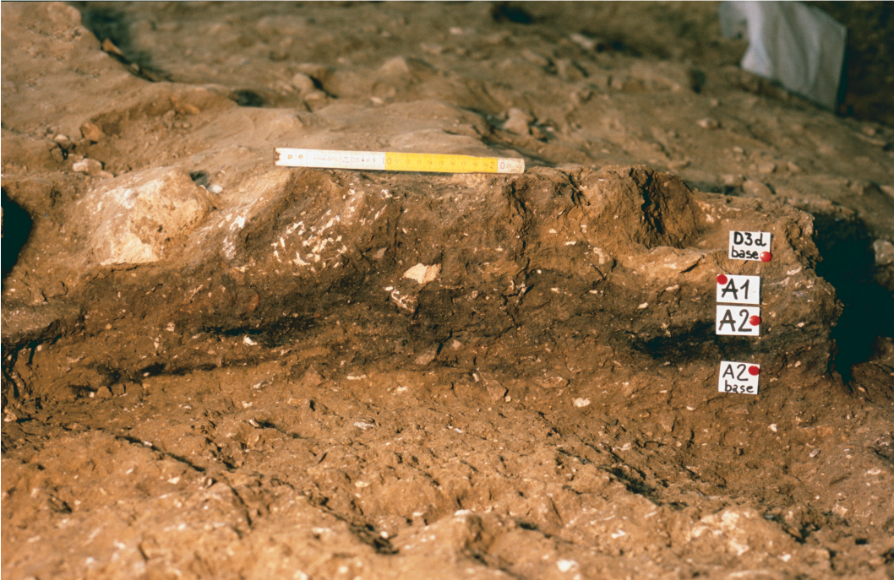

```{r setup, include=FALSE}
knitr::opts_chunk$set(echo = TRUE)
```
```{r, include=FALSE, warning=FALSE}
library(readxl)
library(tidyverse)
library(knitr)
library(kableExtra)
library(janitor)
library(rstatix)
library(MetBrewer)
library(ggpubr)
library(ggstatsplot)
library(flextable)
```

```{r, include=FALSE, warning=FALSE}
## Selecting the blanks belonging to the areas chosen for the technological studies

# A2int ####
dataset_A2int <- read.csv("../data/RF_Dataset_Blank.csv") %>%
  filter(unit == "A2") %>%
  filter(square %in% c("95", "100", "105", "110","115", "120", "125")) %>%
  rename(SU = "unit")

dataset_A2int$SU <- c("A2int")


# A2ext ####
dataset_A2ext <- read.csv("../data/RF_Dataset_Blank.csv") %>%
  filter(unit == "A2") %>%
  filter(square %in% c("55","56", "65", "66")) %>%
  rename(SU = "unit")

dataset_A2ext$SU <- c("A2ext")


# A1ext ####
dataset_A1ext <- read.csv("../data/RF_Dataset_Blank.csv") %>%
  filter(unit == "A1") %>%
  filter(square %in% c("55","56", "65", "66")) %>%
  rename(SU = "unit")

dataset_A1ext$SU <- c("A1ext")

# A1 east ####
dataset_A1east <- read.csv("../data/RF_Dataset_Blank.csv") %>%
  filter(unit == "A1") %>%
  filter(square %in% c("62","63", "72", "73")) %>%
  rename(SU = "unit")

dataset_A1east$SU <- c("A1east")


# D3b alpha ####
dataset_D3balpha <- read.csv("../data/RF_Dataset_Blank.csv") %>%
  rename(SU = "unit") %>%
  filter(SU == "D3b.alpha")

# Merging ####
dataset.blank <- rbind(dataset_A2ext, dataset_A2int, dataset_A1ext,dataset_A1east, dataset_D3balpha)

dataset.blank <- dataset.blank %>%
  mutate(SU = fct_relevel(SU, "A2int", "A2ext", "A1ext", "A1east", "D3b.alpha"))
```

```{r, include=FALSE, warning=FALSE}
## Selecting the cores belonging to the areas chosen for the technological studies

# A2int ####
dataset_core_A2int <- read.csv("../data/RF_Dataset_Core.csv") %>%
  filter(unit == "A2") %>%
  filter(square %in% c("95", "100", "105", "110","115", "120", "125")) %>%
  rename(SU = "unit")

dataset_core_A2int$SU <- c("A2int")


# A2ext ####
dataset_core_A2ext <- read.csv("../data/RF_Dataset_Core.csv") %>%
  filter(unit == "A2") %>%
  filter(square %in% c("55","56", "65", "66")) %>%
  rename(SU = "unit")

dataset_core_A2ext$SU <- c("A2ext")


# A1ext ####
dataset_core_A1ext <- read.csv("../data/RF_Dataset_Core.csv") %>%
  filter(unit == "A1") %>%
  filter(square %in% c("55","56", "65", "66")) %>%
  rename(SU = "unit")

dataset_core_A1ext$SU <- c("A1ext")


# A1 east ####
dataset_core_A1east <- read.csv("../data/RF_Dataset_Core.csv") %>%
  filter(unit == "A1") %>%
  filter(square %in% c("62","63", "72", "73")) %>%
  rename(SU = "unit")

dataset_core_A1east$SU <- c("A1east")


# D3b alpha ####
dataset_core_D3balpha <- read.csv("../data/RF_Dataset_Core.csv") %>%
  rename(SU = "unit") %>%
  filter(SU == "D3b.alpha")


# Merging ####
dataset.core <- rbind(dataset_core_A2ext, dataset_core_A2int, dataset_core_A1ext,dataset_core_A1east, dataset_core_D3balpha)

dataset.core <- dataset.core %>%
  mutate(SU = fct_relevel(SU, "A2int", "A2ext", "A1ext", "A1east", "D3b.alpha"))
```

```{r, include=FALSE, warning=FALSE}
# Creating a dataset that includes all blanks and cores, as well as those fragments and flakes that were only counted and divided according to the technological category in Falcucci et al. (2017) and Falcucci et al. (2020)

dataset.fragments.flakes <- read_csv("../data/RF_Dataset_Fragments_Flakes.csv") %>%
  select(SU, class, blank, technology, preservation, cortex.y.n)

dataset.blank.reduced <- dataset.blank %>%
  select(SU, class, blank, technology, preservation, cortex.y.n)

dataset.core.reduced <- dataset.core %>%
  filter(class != "Core-Tool") %>%
  select(SU, class) %>%
  mutate(blank = NA, technology = NA, preservation = NA, cortex.y.n = NA)

dataset.complete.reduced <- rbind(dataset.fragments.flakes, dataset.blank.reduced, dataset.core.reduced)

dataset.complete.reduced <- dataset.complete.reduced %>%
  mutate(SU = fct_relevel(SU, "A2int", "A2ext", "A1ext", "A1east", "D3b.alpha"))
```

```{r, include=FALSE, warning=FALSE}
comparison <- list(c("A2int", "A2ext"), c("A2int", "A1ext"), c("A2int", "A1east"), c("A2int", "D3b.alpha"), c("A2ext", "A1ext"), c("A2ext", "A1east"), c("A2ext", "D3b.alpha"), c("A1ext", "A1east"), c("A1ext", "D3b.alpha"), c("A1east", "D3b.alpha"))

comparison_no.alpha <- list(c("A2int", "A2ext"), c("A2int", "A1ext"), c("A2int", "A1east"), c("A2ext", "A1ext"), c("A2ext", "A1east"), c("A1ext", "A1east"))

comparison_A2int.ext <- list(c("A2ext", "A2int"))

comparison.no.A1ext <- list(c("A2int", "A2ext"), c("A2int", "A1east"), c("A2int", "D3b.alpha"), c("A2ext", "A1east"), c("A2ext", "D3b.alpha"), c("A1east", "D3b.alpha"))
```

```{r, include=FALSE, warning=FALSE}
#calculation of the SDI
dataset.core <- dataset.core %>%
  mutate(SDI = scar.count.total / surface,
         logSDI = log(SDI))
```

<br>

## SM S1: The formation of the cave and its stratigraphic sequence
Fumane Cave is located on a rock cliff approximately 350 meters above sea level in the western Monti Lessini Plateau within the Venetian pre-Alps of northeastern Italy (see **Fig. 1a**). The initial scientific exploration of the site took place in 1964, followed by excavations conducted by the Natural History Museum of Verona in 1982, focusing on the lowermost deposits exposed during road construction. After a period of inactivity, during which unauthorized excavations caused damage to the southeastern deposits, systematic fieldwork resumed in 1988 under the coordination of the University of Ferrara. Excavations continue today under the direction of one of us (MP).

Fumane is part of a karst complex formed during the Neogene, carved into the Ooliti di San Virgilio—a sequence of thick carbonate sandstone layers with distinctive cross-lamination, cyclically interspersed with micritic limestones. The karst complex consists of a wide opening partially filled with residual dolomite sands, featuring a main cavity (Tunnel B) and two associated tunnels (A and C) that open at the upper section (see **Fig. 1b**). Tunnel C and part of Tunnel B are excavated within the micritic layers, while Tunnel A and the western portion of Tunnel B extend into the carbonate sandstones. These lithological units, extensively dolomitized, are separated by a distinct discontinuity that runs through Tunnel B, significantly influencing the composition of the Stratigraphic Units (SUs). The ceiling of the carbonate sandstone unit has been unstable due to fractures parallel to the overlying rock wall, leading to landslides at the cave entrance. These collapses and sediment buildup eventually prevented access to the cave after the Heinrich Event 3. Thus, the cave’s current morphology and stratigraphic sequence result from two major processes: the collapse of thick calcarenites and the gradual dismantling of micritic banks at the entrance, primarily driven by freeze-thaw cycles during the Late Pleistocene (Broglio & Dalmeri, 2005; Peresani, 2022).

The sequence of archaeological SUs at Fumane is notably complex, characterized by lateral variations in sediment composition between the cave's interior and exterior, as well as between its western and eastern sides. This variability is primarily due to the abrupt transition between the calcarenite and micrite layers, running roughly transverse to the cave's main axis. Surface dissolution of carbonate sandstones led to sand accumulation in the western side of the cave. At the same time, the fragmentation of micrite banks deposited angular rubble with varying sandy-loamy matrices in the central and eastern sectors. This distinction is evident in both Middle and Upper Paleolithic SUs, reflecting climatic instability and differential rates of wall degradation.

During the early systematic excavations, researchers focused on the upper deposits in the cave exterior, revealing traces of recent landslides and some Upper Paleolithic artifacts. As large boulders were cleared, excavation shifted to the cave interior, thus identifying three primary areas: the cave exterior, characterized by boulder accumulation and silicate silt deposition with quartz and mica; the cave drip line; and the cave interior. The cave interior, with varying micro-scale temperature and humidity, has undergone post-depositional deformations, especially in the eastern zone.

The high-resolution stratigraphic sequence of Fumane (see **Fig. 1c,d**) includes several Middle and Upper Paleolithic SUs, spanning from MIS4 to H3 when the cave ceiling collapsed (Peresani, 2022, and references therein). The most anthropogenically influenced sedimentary body, named macro-unit A, contains multiple thin parallel layers and lenses, including Mousterian (A11–A4), Uluzzian (A3), and Protoaurignacian (A2–A1) occupation floors (e.g., Delpiano & Peresani, 2017; Falcucci & Peresani, 2019; Falcucci et al., 2020; Peresani, 2012; Peresani et al., 2016). Aurignacian assemblages are also found in the lower SUs of the overlying macro-unit D. This sedimentary body is marked by a marked lithological shift and evidence of multiple landslides. The harsh climatic conditions documented in macro-unit D, corroborated by small mammal assemblage studies (López-García et al., 2015), contributed to the systematic collapse of the cave ceiling, eventually sealing its entrance. Landslides alternated with aeolian and colluvial sedimentation and pedogenic processes. Human occupation becomes sporadic in the middle of this macro-unit, associated with the early Gravettian (D1d; Falcucci & Peresani, 2019), and nearly absent in the uppermost SUs. The chronological range of Aurignacian and Gravettian SUs (Falcucci & Peresani, 2019; Higham et al., 2009; Higham, 2011; Marín-Arroyo et al., 2023) places human activity between GS-10 (Rasmussen et al., 2014) and Heinrich Event 3 (Hemming, 2004).

<br>

## SM S2: Field description of stratigraphic units A2 to D1f
This section provides a detailed description of the SUs studied in the paper. Information has been summarized from the notebooks of all excavation seasons that involved the Upper Paleolithic sequence, starting with the lowermost Protoaurignacian SU A2 and ending with the almost sterile SU D1f. Photographs taken during fieldwork complement and visually enhance the written descriptions (**Figs. S1–S13**).

### A2
A2 contains one of Europe’s most renowned Protoaurignacian assemblages, dating to approximately 41.2–40.4 ky cal BP (Higham et al., 2009; Higham, 2011). It is a continuous, horizontally bedded SU with a distinct dark brown hue (Munsell Soil Color code: 10YR3/2), rich in charcoal, bones, lithics, and dwelling features. Spanning the entire cave floor, A2 was excavated from the beginning of systematic fieldwork until 2006, with limited interventions in 2014 in the northernmost area of the cave interior, covering about 100 square meters (**Fig. S3**). The thickness of A2 varies from a few centimeters to 10 cm in the cave exterior and around the cave drip line, reaching up to 25 cm in the cave interior near the walls. The cave exterior slopes southwestward, extending beyond a ridge of stones and boulders that mark the dwelling space and a large anthropogenic feature. Most preserved anthropogenic features, including combustion features and toss-zones, are concentrated in the cave exterior and just above the drip line (**Figs. S4** and **S5**). Some features were excavated at the expense of the underlying Uluzzian (e.g., S9, S10, S18) and Mousterian SUs (e.g., S14), leading to localized sediment and artifact mixing (Falcucci et al., 2017; Peresani et al., 2016).

Recent micro-contextual analysis of anthropogenic features in the western portion of A2 revealed that only one feature can be confidently classified as a hearth (S17), while the others represent complex, multi-layered remnants of occupation horizons, partially preserved. The thickness of these features suggests they resulted from intensive, short, and repeated site use rather than prolonged occupations (Marcazzan et al., 2022). Excavators noted that certain features were deformed by the compressive action of boulders and slabs (e.g., S9 and S13), animal burrowing (e.g., S9), cryoturbation (e.g., S14, S17, S18, S21), or partial erosion by water dripping (e.g., S20). Slight cryoturbation caused an uneven microtopography within the SU and partially rearranged the original orientation of artifacts.

In the cave interior, A2 is described as a black silty-sand SU with numerous frost-shattered slabs. It does not reach the cave walls but stops a few centimeters before them, likely due to the progressive retreat of the walls, allowing for loose rubble formation and the possible infiltration of younger sediments and artifacts from overlying SUs. In cross-section, A2 exhibits a concave shape near the western cave wall (squares 117–115 and 127–125), suggesting the presence of a trampled belt along the cave’s main axis (Broglio & Dalmeri, 2005). The SU slopes at an angle of about 10°–20° toward the north in the cave exterior, increasing to 30°–40° in the northernmost interior. Artifacts and stones in this innermost sector were chaotically arranged, particularly in the eastern side and near the walls, where A2 appears rippled with stretched, discontinuous boundaries and contains uplifted artifacts, bones, and stones. SUs here are tilted and compressed, resulting in stratigraphic inversion with the Uluzzian and final Mousterian SUs. The compressive action of boulders and slabs slipping toward the northernmost cave interior due to solifluction has altered the geometric layout of A2 and the overlying SUs. Only one feature, S14 in squares 95–90, was identified in this area, an interpreted combustion feature up to 20 cm thick, showing deformation from cryoturbation. Falcucci et al. (2017) noted the presence of a few Mousterian artifacts in this area.

<br>

### A1
A1, primarily located in the cave exterior and around the drip line, is characterized by a dark brownish hue (10YR3/2) and horizontal bedding. Its thickness ranges from four to 14 cm, with the thickest sections on the southeastern side. Frost-shattered slabs become more prominent near the drip line. The upper boundary between A1 and the D3 SUs shows signs of deformation and disturbance **Fig. S6**), while the boundary between A1 and A2 is generally abrupt in the eastern cave exterior. In the southwestern area, however, the boundary between A2 and A1 was indistinct, leading to its co-excavation with the upper A2 portion. Consequently, some square meters show direct contact between A2 and the D3 SUs. Additionally, A1 sediments tended to merge with the base of SU D3d in a few square meters (e.g., 46, 56, 66, 57, and 67), mainly due to its inclination, prompting hypotheses about artifact mixing between A1 and the base of D3d during excavations.

<br>

### A2R
In the cave interior, A2 displayed a rather discontinuous character. In the eastern side, a distinctive dark reddish SU (**Fig. S7a**), dominated by frost-shattered slabs, intermingled with the darker A2 sediments, nearly replacing them. This SU, designated as A2R (“R” for red), varies in thickness from 10 to 25 cm toward the eastern cave wall. A2R is notably disturbed and undulated, occasionally showing a stratigraphic inversion with the Uluzzian SU A3, especially in square 127. Adjacent to the eastern cave wall, A2R is overlain by the Mousterian SU A5+A6, leading to an inverted stratigraphy due to the tilting and compression of the stratigraphic package. This compression has created a prominent fold, elevating A2R up to 50 cm, almost reaching the surface (**Fig. S7b**). This fold sharply demarcates the deposition of yellow sands in the western sector (SU D1c) and frost-shattered gravel in the eastern sector (SU D3+D6).

<br>

### The D3 complex in the cave exterior and around the drip line
In the cave exterior and around the drip line, SUs A2 and A1 are overlain by a detrital stratigraphic complex named D3, further subdivided into several SUs based on lithological content and archaeological evidence (see **Fig. S1**). D3 comprises sandy loamy sediments with a weak angular polyhedral structure and small frost-shattered slabs, often arranged in thin layers that typically slope inward into the cavity. Notably, the SUs within D3 do not precisely match those described in the cave interior due to changes in sediment facies, post-depositional deformations, and the thinning of the sequence. While the D3 SUs may not be as archaeologically rich as A2 and A1, they are crucial for understanding the chrono-cultural development of the Aurignacian in northeastern Italy (Falcucci et al., 2020). The D3 SUs are detailed as follows:

**D3dbase.** The lowest SU within the D3 complex, D3d base, is observed in direct contact with either A1 or A2. Its sediment composition exhibits slight differences compared to the overlying D3d. Near Tunnel A, D3d base primarily consists of sands that filled erosional structures caused by water dripping from the tunnel, at the expense of A2. In some areas, such as squares 57, 67, and 68, D3d base appears to stratigraphically complement SU A1.

**D3d.** D3d marks the first documented landslide event at Fumane Cave, characterized by a dense accumulation of boulders and angular stones, each around 10 cm in size, mixed with a sandy fine fraction (**Fig. S8**). A portion of these stones appears to be intentionally arranged in a sub-horizontal pavement, although no geoarchaeological studies have verified this interpretation (Peretto et al., 2004). D3d is thicker in the cave exterior and gradually thins inward. While its boundary with the overlying SU D3b alpha is well-defined in the southwestern area, it was inconsistently defined in the southeastern area during excavations. This SU contains accumulations of stone artifacts and bones. Notably, Falcucci et al. (2020) treated D3b alpha and D3d as a single analytical unit based on fieldwork and excavation documentation.

**D3b alpha.** D3b alpha represents the most notable evidence of human occupation within the D3 complex, and it dates to the Heinrich Event 4 (Marín-Arroyo et al., 2023). Identified as a sandy-silty dark brown SU at the base of D3b, D3b alpha was excavated mainly in the southwestern area of the cave from 1996 onward (**Fig. S9a**). Earlier excavations in the southeastern area did not identify this thin SU, potentially due to differential sediment deposition and excavation techniques, which could explain the abrupt end of the SU spatial distribution along the midline of the excavation area (Broglio et al., 2006). The careful excavation in the southwestern area of the cave and around the drip line allowed for precise documentation of this SU, potentially aided by distinct sediment composition and a higher concentration of cultural remains. Archaeological finds from D3b alpha, typically within a few centimeters of sediment, include a well-preserved anthropogenic feature in square 57 (S15), two primary lithic workshops (**Fig. S9b**), scattered bones, and a split-based antler point. Numerous artifacts (n = 352) were meticulously piece-plotted, and some debitage refits were noted (De Stefani, 2003). Excavators observed that frost activity caused minor rearrangement of artifacts near S15 and the drip line, but despite this, artifacts generally appeared in place. The SU slopes northward, with the gradient increasing toward Tunnel B. Near Tunnel A, D3b alpha shows signs of erosion from hydrological activity, with sands from the tunnel filling erosive boundaries, creating alternating sandy strips and blackish sandy-silt sediments. The outermost excavated area contains minimal archaeological material, while D3b alpha seems to extend inward.

**D3b and D3a.** During the initial excavation seasons (1989–1995), two main SUs, D3a (upper) and D3b (lower), were distinguished within the D3 complex. D3a is characterized by sandy sediments mixed with frost-shattered slabs and aeolian dust, with thickness varying from about 9 cm in the cave exterior to a few centimeters after the drip line. Due to sparse artifact content, D3a was subdivided into four sub-SUs and not systematically sieved. D3b lies beneath D3a, containing richer archaeological content, including charcoal deposits, faunal remains, and a split-based antler point (i.e., square 65) analogous to the one discovered in D3b alpha. Evidence of on-site knapping is also present, with a core showing refitted bladelets and maintenance flakes (Bertola et al., 2013). As excavations progressed inward, D3a and D3b merged and thinned, prompting collective excavation as D3a+b toward the cave interior.

<br>

### D6 and D3 in the cave interior
**D6.** North of the drip line, a distinct pocket of angular clast-supported open-work breccia was identified above SU A2 (**Fig. S10**). This SU was designated as D6 and was mostly excavated during the initial fieldwork seasons. D6 is characterized by a substantial thickness and was divided into two artificial spits: D6a (upper portion) exhibited a notable scarcity of archaeological materials; D6b (lower portion) contained a relatively high concentration of artifacts. However, in many cases, the spatial documentation of the artifacts within D6 was incomplete, likely due to an excavation strategy that focused on quickly accessing SU A2.

**D3+D6.** Initially excavated north of the drip line in the proximity of Tunnel C, this SU aimed to delineate the transition between the angular breccia of D6 and D3a+b, particularly toward the western sector of the excavation area. The sediment composition closely resembles D6, primarily consisting of open-work angular breccia with silty-sandy fine particles, and its distribution appears sporadic. As excavations moved inward, D3+D6 was used to describe a thick SU of frost-shattered slabs originating from the cave wall (**Fig. S11**). In the innermost cave areas, D3+D6 was subdivided into a lower SU (approx. 30 cm thick) and an upper SU (40–50 cm thick), extending transversely to D1c, found in the western cave. In areas like square 157, D3+D6 replaced other SUs, directly overlying the Mousterian SU A5+A6. Identifying clear separations between SUs in this area was challenging (Falcucci et al., 2017; Peresani et al., 2021).

**D3a+b, D3b alpha, and D3a+b sabbie.** In the western sector of the cave interior, SUs vary significantly in sediment composition. Following A2, a thin SU labeled D3a+b, interpreted as a continuation of D3a and D3b from the cave exterior, consists of dark-brown sandy-loamy sediment with few frost-shattered slabs (see **Fig. S2**), extending laterally to SUs D6 and D3+D6. The base (D3b alpha) is darker and richer in organic material, charcoal, and artifacts, measuring 2–3 cm in thickness (**Fig. S12**). It thins out in the innermost excavation area and, according to the excavators, correlates with D3b alpha excavated externally. Below D3a+b and D3b alpha, a yellow sandy SU, labeled D3a+b sabbie (sabbie meaning sands in Italian), likely formed from surface dissolution of local calcarenites. Its thickness varies from 1 to 15 cm, with an irregular and discontinuous surface, sometimes filling erosive depressions found in SUs A2 and A2R.

<br>

### The D1 complex
The D1 complex marks the final phase of sedimentation at Fumane Cave, ultimately sealing the cave. Covering the entire excavation area, its thickness decreases toward the cave interior, where post-depositional deformations occurred under periglacial conditions. D1 was subdivided based on lithological characteristics:

**D1c.** This lowest SU, directly in contact with D3a+b, has limited archaeological evidence within a predominantly light brown laminated sand groundmass (see **Fig. S2**). It measures approximately 25–30 cm in thickness and represents a significant rockfall event documented at the site. Field notes indicate that some of the smaller boulders show signs of inward movement due to gelifluction, deforming the underlying sediments, with stoniness increasing inward and open-work breccia near the cave wall.

**D1d.** Overlying D1c, this SU consists of sandy-loam brown sediment with mild polyhedral aggregation and frost-shattered slabs oriented toward the cave’s external margin (**Fig. S13**). Its base, around 5 cm thick, contains lithic artifacts attributed to the early Gravettian, predating Heinrich Event 3 (López-García et al., 2015). Charcoal is a significant component of this SU and forms a continuous charcoal line at its base (Falcucci & Peresani, 2019).

**D1e–D1f.** The uppermost SUs correspond to the latest rockfall event, comprising boulders and frost-shattered slabs in a brown silty-sandy matrix. Some boulders accumulated near the cave drip line, while others slid down the slope into the inner cave. The top SU, D1f, represents a rendzina soil developed on loose open-work breccia, reaching up to 12 cm thick and exposed on the cave’s surface (see **Figs. S2** and **S11**). These SUs contain few lithic artifacts but numerous herbivore bones with gnawing marks, suggesting frequent visits by carnivores during this phase.

<br>

### Summary of the main post-depositional events and agents
The formation of the Upper Paleolithic stratigraphic sequence at Fumane Cave has been influenced by various post-depositional events and disturbance agents, which have impacted the preservation of anthropogenic features. These agents can be classified into two categories: geological and biological. Geological agents have been primarily driven by the harsh climatic conditions that characterized the transition from MIS3 to the beginning of MIS2. These conditions led to periglacial activity, including frost action, which in turn resulted in the gradual collapse of the cave’s ceiling. This collapse played a major role in shaping the geological layers and their composition. Biological agents also contributed to post-depositional disturbances. Animal burrows, likely created by marmots and dormice, represent one of these agents. Additionally, human activity in the form of combustion features and trampling left their mark on the site. At a microscale, soil mesofauna, and plant roots contributed to burrowing and disturbance.

Marmot burrows were frequently identified during excavations because they were very few and isolated within the primary deposits. These burrows were often located in close proximity to anthropic features, such as S9 and S10. The result of this interaction was a mixing of sediments of different colors and, in some instances, the mixing of archaeological materials from different phases. To address this issue, archaeological materials excavated within animal burrows were typically labeled accordingly. However, in cases where smaller or less conspicuous features were involved, it was not always possible to maintain a clear separation from the surrounding archaeological SUs.

Additionally, there is some evidence of percolation and dripping of water, including snow meltwater, which may have affected the SUs (Kehl et al., in preparation). Shallow channels filled with sterile sands, particularly near Tunnel A (e.g., sq. 49–59), serve as indicators of these processes, especially when the SUs were still exposed on the surface or only partially buried.

The cave exterior was primarily affected by numerous landslide events. These events, which occurred during at least three distinct instances, resulted in the collapse of several boulders and slabs. This, coupled with erosion in the southernmost region of the excavation, likely led to the partial destruction of archaeological deposits. Some boulders even rolled toward the cave interior due to solifluction—a process driven by the alternating cycles of freezing and thawing. These displaced boulders were likely responsible for compressing and deforming the SUs, including combustion features like S10.

Conversely, the cave interior experienced multiple cryoturbation events caused by freezing and thawing activity, attributed to increased humidity in this underground environment. The effects of frost activity are evident in the undulated morphology of the SUs. It began to be recorded around the cave drip line and became more pronounced toward the northernmost area of the cave interior. These events resulted in the frequent alteration of the original arrangement of artifacts, often causing them to become tilted up and oriented vertically. In some extreme cases, localized stratigraphic inversion was observed and documented accordingly.

A noteworthy aspect of Fumane is the detailed micromorphological study that was conducted, revealing that the Middle and Upper Paleolithic sequence experienced minimal sediment reworking and maintained a high degree of stratigraphic integrity (Kehl et al., in preparation). This micromorphological analysis not only supports the field observations but also provides additional insights into the impact of post-depositional events. However, it is important to mention that the thin sections available for the Aurignacian SUs do not cover the most disturbed areas of the excavations, particularly in the cave’s most internal areas. Interestingly, the micromorphological evidence suggests that occurrences of anthropogenic sedimentation and trampling are relatively rare outside of anthropogenic features. The main diachronic changes identified in the sedimentary record appear to be linked more to fluctuations in moisture levels rather than temperature variations, as detailed in Kehl et al. (in preparation).

<br>

## SM Figures

### Figure S1
```{r, echo=FALSE, fig.align='center', out.width="100%"}

```
  **Figure S1.** Stratigraphic section at the entrance of Tunnel A showing stratigraphic units D1e to A2. Note the gradual increase in loamy-sandy sediments over the coarse fraction as it transitions towards the cave exterior (excavation campaign 1992).

<br>

### Figure S2
```{r, echo=FALSE, fig.align='center', out.width="100%"}
knitr::include_graphics("../output/figures/Figure_S2.png")
```
  **Figure S2.** Photograph of the sagittal section exposed in squares 136 and 146 during the 2003 excavation campaign, revealing stratigraphic units from D1f to A9 in the innermost area of the cave. Note the tilt caused by post-depositional deformations.

<br>

### Figure S3
```{r, echo=FALSE, fig.align='center', out.width="100%"}
knitr::include_graphics("../output/figures/Figure_S3.png")
```
  **Figure S3.** Excavation of stratigraphic unit A2 during the 1998 excavation campaign, spanning across the cave exterior and the cave drip line. Observe the accumulation of charcoal features in the central area of the photograph, facing west.

<br>

### Figure S4
```{r, echo=FALSE, fig.align='center', out.width="100%"}
knitr::include_graphics("../output/figures/Figure_S4.png")
```
  **Figure S4.** Three different views (**a**, **b**, and **c**) of the excavation of stratigraphic unit A2, with feature S10 highlighted in red within squares 55–56. Pay attention to the large blocks characterizing the surface of A2 in this area of the cave.

<br>

### Figure S5
```{r, echo=FALSE, fig.align='center', out.width="100%"}
knitr::include_graphics("../output/figures/Figure_S5.png")
```
  **Figure S5.** **a**) Views of features S16, S17, S18, and S19 excavated in stratigraphic unit A2 in the western portion of the cave; **b**) close-up photograph of features S17 and S19.

<br>

### Figure S6
```{r, echo=FALSE, fig.align='center', out.width="100%"}

```
  **Figure S6.** Deformations of the original sedimentary pattern in A2, A1, and D3d base, with patchy intrusions of A2 sediment into D3d base, undulating boundaries between layers, and rearrangement of stones in D3d base, as observed in the S-N section of square 87 (looking NE; 1998 excavation campaign).

### Figure S7
```{r, echo=FALSE, fig.align='center', out.width="100%"}
knitr::include_graphics("../output/figures/Figure_S7.png")
```
  **Figure S7.** **a**) View of the ochre patch of A2R exposed during the 2001 excavation campaign in squares 117, 126, and 127 along the main sagittal section and at the base of the W-E section. Note the slope on the bottom left of the excavation; **b**) Exposure of A2 and A2R during the 2003 excavation campaign in the innermost area of the cave (squares 127, 128, and 137). Pay attention to the pronounced fold in the proximity of the right cave wall.

<br>

### Figure S8
```{r, echo=FALSE, fig.align='center', out.width="100%"}
knitr::include_graphics("../output/figures/Figure_S8.png")
```
  **Figure S8.** Two views (**a** and **b**) of the accumulation of small-sized subangular blocks, likely arranged to form a pavement in stratigraphic unit D3d excavated during the 1990 excavation campaign. For size reference, the plate displaying the name of the site and unit measures 20x15 cm.

<br>

### Figure S9
```{r, echo=FALSE, fig.align='center', out.width="100%"}
knitr::include_graphics("../output/figures/Figure_S9.png")
```
  **Figure S9.** **a**) Excavation of stratigraphic unit D3balpha during the 1997 campaign in the western portion of the cave. The section visible at the back corresponds to Fig. S1; **b**) Close-up photograph of the accumulation of lithics in squares 58–68.

<br>

### Figure S10
```{r, echo=FALSE, fig.align='center', out.width="100%"}
knitr::include_graphics("../output/figures/Figure_S10.png")
```
  **Figure S10.** Stratigraphic unit D6 under excavation during the 2001 excavation campaign in the cave interior. Note the clear difference between the breccia sediment of D6 and the underlying A2, which contains charcoal and ochre.

<br>

### Figure S11
```{r, echo=FALSE, fig.align='center', out.width="100%"}
knitr::include_graphics("../output/figures/Figure_S11.png")
```
  **Figure S11.** Excavation of A2, A2R, and D3+D6 during the 2002 excavation campaign in squares 125, 126, 135, and 136. Pay attention to the sharp difference in sediment composition between A2 and the frost-shattered stones characterizing stratigraphic units A2R and D3+D6.

<br>

### Figure S12
```{r, echo=FALSE, fig.align='center', out.width="100%"}
knitr::include_graphics("../output/figures/Figure_S12.png")
```
  **Figure S12.** Exposure of stratigraphic units D3b alpha and D3a+b in squares 127, 128, and 137 during the 2005 excavation campaign. Pay attention to the dark color of D3b alpha in this area of the cave compared to D3a+b.

<br>

### Figure S13
```{r, echo=FALSE, fig.align='center', out.width="100%"}

```
  **Figure S13.** Excavation of stratigraphic unit D1d during various excavation campaigns: **a** and **b**) in the cave interior during 1991, **c**) in square 78 at the entrance of Tunnel A in 1996, **d**) in square 127 in 2001, **e**) in squares 126 and 136 in 2002, and **f**) in squares 127 and 137 in 2005. Pay attention to the presence of large fragments of charred wood in **d**.

<br>

### Figure S14
```{r, echo=FALSE, fig.align='center', out.width="100%"}
knitr::include_graphics("../output/figures/Figure_S14.png")
```
  **Figure S14.** **a**) Organization of the working tables for conducting break connection searches at the Department of Humanities, Anthropological and Prehistoric Unit, University of Ferrara; **b**) Identification of a few break connections; **c**) Table displaying blade fragments from Scaglia Variegata, Scaglia Rossa, and other less common raw materials. Fragments are arranged based on fragmentation, with proximal portions at the bottom, followed by mesial and distal fragments; **d**) Table presenting non-cortical blade fragments from the Maiolica variety, the most abundant raw material at the site. The arrangement follows the same  system as described above; **e**) Collection of blades made on Maiolica, showing variations in cortical coverage on the left side of the fragments. Two additional groups were established to compare blades with cortical coverage on the middle and right sides.

<br>

### Figure S15
```{r, echo=FALSE, fig.align='center', out.width="100%"}

```
  **Figure S15.** Plan views of the cave showing the areas selected for the technological studies of A2int, A2ext, A1ext, and A1east (**a**) and D3b alpha (**b**). Dotted lines indicate the cave drip line and unexposed walls of the cave tunnels.

<br>

### Figure S16
```{r, echo=FALSE, warning=FALSE, message=FALSE, fig.width=10, fig.height=6, fig.retina=2}
dataset.complete.reduced %>%
  mutate(SU = recode(SU, D3b.alpha = "D3b alpha")) %>%
  rename(`Blank type` = blank) %>%
  filter(class == "Blank") %>%
  ggbarstats(x = `Blank type`, y = SU, label = "both") +
  theme(text = element_text(size = 16),
        axis.text = element_text(size = 16),
        axis.title = element_text(size = 16)) +
  scale_fill_manual(values=met.brewer("Navajo", 3))
```
  **Figure S16.** Stacked bar charts illustrating the distribution of flakes, bladelets, and blades across the studied assemblages. The figure is complemented by the Pearson’s χ2-test of independence, demonstrating that the variation in the frequency of blank types between assemblages is statistically significant. Tools have been excluded from this quantification.

<br>

### Figure S17
```{r, echo=FALSE, warning=FALSE, message=FALSE, fig.width=12, fig.height=10, fig.retina=2}
dataset.complete.reduced %>%
  mutate(SU = recode(SU, D3b.alpha = "D3b alpha")) %>%
  rename(Technology = technology) %>%
  filter(class == "Blank") %>%
  filter(blank == "Flake") %>%
  ggbarstats(x = Technology, y = SU, label = "both") +
  theme(text = element_text(size = 18),
        axis.text = element_text(size = 18),
        axis.title = element_text(size = 18)) +
  scale_fill_manual(values=met.brewer("Navajo", 4))
```
  **Figure S17.** Stacked bar charts illustrating the distribution of technological categories among flakes and across the studied assemblages. The figure is complemented by Pearson’s χ2-test of independence, demonstrating that the variation in the frequency of blank types between assemblages is statistically significant. Tools have been excluded from this quantification.

<br>

### Figure S18
```{r, echo=FALSE, warning=FALSE, message=FALSE, fig.width=12, fig.height=12, fig.retina=2}
dataset.complete.reduced %>%
  mutate(SU = recode(SU, D3b.alpha = "D3b alpha")) %>%
  rename(Technology = technology) %>%
  filter(class == "Blank") %>%
  filter(blank == "Blade") %>%
  ggbarstats(x = Technology, y = SU, label = "both") +
  theme(text = element_text(size = 18),
        axis.text = element_text(size = 18),
        axis.title = element_text(size = 18)) +
  scale_fill_manual(values=met.brewer("Navajo", 4))
```
  **Figure S18.** Stacked bar charts illustrating the distribution of technological categories among blades and across the studied assemblages. The figure is complemented by Pearson’s χ2-test of independence, demonstrating that the variation in the frequency of blank types between assemblages is statistically significant. Tools have been excluded from this quantification.

<br>

### Figure S19
```{r, echo=FALSE, warning=FALSE, message=FALSE, fig.width=12, fig.height=12, fig.retina=2}
dataset.complete.reduced %>%
  mutate(SU = recode(SU, D3b.alpha = "D3b alpha")) %>%
  rename(Technology = technology) %>%
  filter(class == "Blank") %>%
  filter(blank == "Bladelet") %>%
  ggbarstats(x = Technology, y = SU, label = "both") +
  theme(text = element_text(size = 18),
        axis.text = element_text(size = 18),
        axis.title = element_text(size = 18)) +
  scale_fill_manual(values=met.brewer("Navajo", 4))
```
  **Figure S19.** Stacked bar charts illustrating the distribution of technological categories among bladelets and across the studied assemblages. The figure is complemented by Pearson’s χ2-test of independence, demonstrating that the variation in the frequency of blank types between assemblages is statistically significant. Tools have been excluded from this quantification.

<br>

### Figure S20
```{r, echo=FALSE, warning=FALSE, message=FALSE}
dataset.blank %>%
  filter(blank == "Blade" | blank =="Bladelet",
         class == "Blank" | class == "Tool") %>%
  mutate(SU = recode(SU, D3b.alpha = "D3b alpha")) %>%
  rename(`Blank type` = blank) %>%
  ggplot(aes(x=width, y=thickness)) +
  geom_point(aes(color=`Blank type`, fill=`Blank type`)) +
  geom_smooth(method="lm") +
  facet_wrap(~SU) +
  scale_color_manual(values=met.brewer("Navajo")) +
  theme_minimal() +
  theme(text = element_text(size = 16),
        axis.text = element_text(size = 12),
        axis.title = element_text(size = 14),
        legend.position = "right") +
  guides(color = guide_legend(override.aes = list(size = 5))) +
  labs(y= "Thickness (mm)", x = "Width (mm)")
```
  **Figure S20.** Scatterplots showing the distribution of width and thickness values of laminar blanks (i.e., blades and bladelets) across the studied assemblages, complemented by linear regressions.

<br>

### Figure S21
```{r, echo=FALSE, warning=FALSE}
dataset.blank %>%
  filter(blank =="Blade",
           preservation == "Complete",
           class == "Blank",
         SU != "D3b.alpha") %>%
  mutate(SU = fct_relevel(SU, "A2int", "A2ext", "A1ext", "A1east")) %>%
  ggplot(aes(x = SU, y = length)) +
  geom_boxplot(aes(fill = SU)) +
  stat_compare_means(comparison = comparison_no.alpha) +
  stat_compare_means(label.y = 160) +
  geom_jitter(shape=16, position=position_jitter(width = 0.2), alpha = 0.5) +
  # geom_jitter(shape=16, position=position_jitter(width = 0.1)) +
  ggthemes::theme_clean() +
  scale_fill_manual(values=met.brewer("Navajo")) +
  theme(text = element_text(size = 18),
        axis.text = element_text(size = 12),
        axis.title = element_text(size = 14),
        legend.position = "none") +
  labs(y= "Length (mm)")
```
  **Figure S21.** Boxplots with jittered points showing the distribution of length values of complete blades across the studied assemblages. The figure includes results of the Kruskal-Wallis test and the pairwise comparisons.

<br>

### Figure S22
```{r, echo=FALSE, warning=FALSE}
dataset.blank %>%
  filter(blank =="Blade",
         class == "Blank") %>%
  mutate(SU = fct_relevel(SU, "A2int", "A2ext", "A1ext", "A1east", "D3b.alpha")) %>%
  ggplot(aes(x = SU, y = width)) +
  geom_boxplot(aes(fill = SU)) +
  stat_compare_means(comparison = comparison) +
  stat_compare_means(label.y = 60) +
  # geom_jitter(shape=16, position=position_jitter(width = 0.1)) +
  geom_jitter(shape=16, position=position_jitter(width = 0.2), alpha = 0.5) +
  ggthemes::theme_clean() +
  scale_x_discrete(labels = c("A2int", "A2ext", "A1ext", "A1east", "D3b alpha")) +
  scale_fill_manual(values=met.brewer("Navajo")) +
  theme(text = element_text(size = 18),
        axis.text = element_text(size = 12),
        axis.title = element_text(size = 14),
        legend.position = "none") +
  labs(y= "Width (mm)")
```
  **Figure S22.** Boxplots with jittered points showing the distribution of width values of blades across the studied assemblages. The figure includes results of the Kruskal-Wallis test and the pairwise comparisons.

<br>

### Figure S23
```{r, echo=FALSE, warning=FALSE}
dataset.blank %>%
  filter(blank =="Blade",
         class == "Blank") %>%
  mutate(SU = fct_relevel(SU, "A2int", "A2ext", "A1ext", "A1east", "D3b.alpha")) %>%
  ggplot(aes(x = SU, y = thickness)) +
  geom_boxplot(aes(fill = SU)) +
  stat_compare_means(comparison = comparison) +
  stat_compare_means(label.y = 36) +
  geom_jitter(shape=16, position=position_jitter(width = 0.2), alpha = 0.5) +
  # geom_jitter(shape=16, position=position_jitter(width = 0.1)) +
  ggthemes::theme_clean() +
  scale_x_discrete(labels = c("A2int", "A2ext", "A1ext", "A1east", "D3b alpha")) +
  scale_fill_manual(values=met.brewer("Navajo")) +
  theme(text = element_text(size = 18),
        axis.text = element_text(size = 12),
        axis.title = element_text(size = 14),
        legend.position = "none") +
  labs(y= "Thickness (mm)")
```
  **Figure S23.** Boxplots with jittered points showing the distribution of thickness values of blades across the studied assemblages. The figure includes results of the Kruskal-Wallis test and the pairwise comparisons.

<br>

### Figure S24
```{r, echo=FALSE, warning=FALSE}
dataset.blank %>%
  filter(blank =="Bladelet",
           preservation == "Complete",
           class == "Blank") %>%
  mutate(SU = fct_relevel(SU, "A2int", "A2ext", "A1ext", "A1east", "D3b.alpha")) %>%
  ggplot(aes(x = SU, y = length)) +
  geom_boxplot(aes(fill = SU)) +
  stat_compare_means(comparison = comparison) +
  stat_compare_means(label.y = 138) +
  geom_jitter(shape=16, position=position_jitter(width = 0.2), alpha = 0.5) +
  # geom_jitter(shape=16, position=position_jitter(width = 0.1)) +
  ggthemes::theme_clean() +
  scale_fill_manual(values=met.brewer("Navajo")) +
  scale_x_discrete(labels = c("A2int", "A2ext", "A1ext", "A1east", "D3b alpha")) +
  theme(text = element_text(size = 18),
        axis.text = element_text(size = 12),
        axis.title = element_text(size = 14),
        legend.position = "none") +
  labs(y= "Length (mm)")
```
  **Figure S24.** Boxplots with jittered points showing the distribution of length values of complete bladelets across the studied assemblages. The figure includes results of the Kruskal-Wallis test and the pairwise comparisons.

<br>

### Figure S25
```{r, echo=FALSE, warning=FALSE}
dataset.blank %>%
  filter(blank =="Bladelet",
         class == "Blank") %>%
  mutate(SU = fct_relevel(SU, "A2int", "A2ext", "A1ext", "A1east", "D3b.alpha")) %>%
  ggplot(aes(x = SU, y = width)) +
  geom_boxplot(aes(fill = SU)) +
  stat_compare_means(comparison = comparison) +
  stat_compare_means(label.y = 25) +
  geom_jitter(shape=16, position=position_jitter(width = 0.2), alpha = 0.5) +
  # geom_jitter(shape=16, position=position_jitter(width = 0.1)) +
  ggthemes::theme_clean() +
  scale_fill_manual(values=met.brewer("Navajo")) +
    scale_x_discrete(labels = c("A2int", "A2ext", "A1ext", "A1east", "D3b alpha")) +
  theme(text = element_text(size = 18),
        axis.text = element_text(size = 12),
        axis.title = element_text(size = 14),
        legend.position = "none") +
  labs(y= "Width (mm)")
```
**Figure S25.** Boxplots with jittered points showing the distribution of width values of bladelets across the studied assemblages. The figure includes results of the Kruskal-Wallis test and the pairwise comparisons.

<br>

### Figure S26
```{r, echo=FALSE, warning=FALSE}
dataset.blank %>%
  filter(blank =="Bladelet",
         class == "Blank") %>%
  mutate(SU = fct_relevel(SU, "A2int", "A2ext", "A1ext", "A1east", "D3b.alpha")) %>%
  ggplot(aes(x = SU, y = thickness)) +
  geom_boxplot(aes(fill = SU)) +
  stat_compare_means(comparison = comparison) +
  stat_compare_means(label.y = 20) +
  geom_jitter(shape=16, position=position_jitter(width = 0.2), alpha = 0.5) +
  # geom_jitter(shape=16, position=position_jitter(width = 0.1)) +
  ggthemes::theme_clean() +
  scale_fill_manual(values=met.brewer("Navajo")) +
  scale_x_discrete(labels = c("A2int", "A2ext", "A1ext", "A1east", "D3b alpha")) +
  theme(text = element_text(size = 18),
        axis.text = element_text(size = 12),
        axis.title = element_text(size = 14),
        legend.position = "none") +
  labs(y= "Thickness (mm)")
```
**Figure S26.** Boxplots with jittered points showing the distribution of thickness values of bladelets across the studied assemblages. The figure includes results of the Kruskal-Wallis test and the pairwise comparisons.

<br>

### Figure S27
```{r, echo=FALSE, warning=FALSE}
dataset.blank %>%
  filter(blank =="Bladelet",
           preservation == "Complete",
                  class == "Blank") %>%
  mutate(SU = fct_relevel(SU, "A2int", "A2ext", "A1ext", "A1east", "D3b.alpha")) %>%
  ggplot(aes(x = SU, y = elongation)) +
  geom_boxplot(aes(fill = SU)) +
  stat_compare_means(comparison = comparison) +
  stat_compare_means(label.y = 20) +
  geom_jitter(shape=16, position=position_jitter(width = 0.2), alpha = 0.5) +
  # geom_jitter(shape=16, position=position_jitter(width = 0.1)) +
  ggthemes::theme_clean() +
  scale_fill_manual(values=met.brewer("Navajo")) +
    scale_x_discrete(labels = c("A2int", "A2ext", "A1ext", "A1east", "D3b alpha")) +
  theme(text = element_text(size = 18),
        axis.text = element_text(size = 12),
        axis.title = element_text(size = 14),
        legend.position = "none") +
  labs(y= "Elongation index")
```
**Figure S27.** Boxplots with jittered points showing the distribution of elongation ratios of complete bladelets across the studied assemblages. The figure includes results of the Kruskal-Wallis test and the pairwise comparisons.

<br>

### Figure S28
```{r, echo=FALSE, warning=FALSE}
dataset.blank %>%
  filter(blank =="Bladelet",
           preservation == "Complete",
           class == "Blank") %>%
  mutate(SU = fct_relevel(SU, "A2int", "A2ext", "A1ext", "A1east", "D3b.alpha")) %>%
  mutate(raw.material = recode(raw.material, Other = "Other", Scaglia.Rossa = "Other", Scaglia.Variegata = "Other", Undetermined = "Other")) %>%
  ggplot(aes(x = SU, y = length)) +
  geom_boxplot(aes(fill = SU)) +
  stat_compare_means(comparison = comparison) +
  stat_compare_means(label.y = 138) +
  geom_jitter(shape=16, position=position_jitter(width = 0.2), alpha = 0.5) +
  # geom_jitter(shape=16, position=position_jitter(width = 0.1)) +
  ggthemes::theme_clean() +
  scale_fill_manual(values=met.brewer("Navajo")) +
  scale_x_discrete(labels = c("A2int", "A2ext", "A1ext", "A1east", "D3b alpha")) +
  theme(text = element_text(size = 18),
        axis.text = element_text(size = 12),
        axis.title = element_text(size = 14),
        legend.position = "none") +
  labs(y= "Length (mm)") +
    facet_wrap(~raw.material)
```
  **Figure S28.** Boxplots with jittered points showing the distribution of length values of complete bladelets across the studied assemblages, sorted according to raw material type. The category *Other* includes raw material varieties such as Scaglia Variegata, Scaglia Rossa, and Eocenic chert. The figure includes results of the Kruskal-Wallis test and the pairwise comparisons.

<br>

### Figure S29
```{r, echo=FALSE, fig.align='center', out.width="100%"}

```
  **Figure S29.** Scree plot of the Multiple Correspondence Analysis illustrating the contribution of dimensions in percentage.

<br>

### Figure S30
```{r, echo=FALSE, fig.align='center', out.width="100%"}

```
  **Figure S30.** Visualization depicting the contribution of variables to the first and second dimensions of the Multiple Correspondence Analysis. The category "yes" refers to the presence of profile twisting.

<br>

### Figure S31
```{r, echo=FALSE, fig.align='center', out.width="100%"}

```
  **Figure S31.** Carinated endscraper from SU D3b alpha. A portion of the flaking surface is obscured due to an invasive flake scar. Additional bladelet scars are visible on the right lateral side of the flaking surface. The images are derived from the cores’ 3D mesh.

### Figure S32
```{r, echo=FALSE, warning=FALSE}
Fig.core.blank.comp.data1 <- dataset.blank %>%
  mutate(SU = recode(SU, D3b.alpha = "D3b alpha")) %>%
  filter(blank == "Bladelet" | blank == "Blade") %>%
  filter(SU == "D3b alpha")
Fig.core.blank.comp.data2 <- dataset.core %>%
  filter(classification.1 != "Flake" & classification.1 != "Tested" & classification.1 != "Shatter") %>%
  mutate(SU = recode(SU, D3b.alpha = "D3b alpha")) %>%
  filter(SU == "D3b alpha")

ggplot() +
  geom_boxplot(Fig.core.blank.comp.data1, 
               mapping=aes(x=blank, y=length, fill = blank)) +
  geom_boxplot(Fig.core.blank.comp.data2,
               mapping=aes(x=classification.4, y=flaking.surface.length, fill = classification.4)) +
  geom_jitter(Fig.core.blank.comp.data1,
              mapping=aes(x=blank, y=length, fill = SU), shape=16, alpha = 0.7, position=position_jitter(0.2)) +
  geom_jitter(Fig.core.blank.comp.data2,
              mapping=aes(x=classification.4, y=flaking.surface.length, fill = SU), shape=16, alpha = 0.7, position=position_jitter(0.2)) +
  facet_wrap(~SU) +
  theme_bw(base_size = 20)+
  theme(panel.grid.major = element_blank(), panel.grid.minor = element_blank())+
  theme(axis.title.y = element_text(vjust = 3)) +
  theme(axis.title.x = element_text(vjust = -1)) + 
  theme(legend.position = "none") +
  theme(axis.text.x = element_text(angle = 45, hjust=1)) +
  theme(strip.background = element_rect(colour = "black", fill = "white"), strip.text.x = element_text(face = "bold")) +
  labs(x = "Classification", y = "Length (mm)")
```
  **Figure S32.** Boxplots with jittered points comparing the length of the flaking surfaces of carinated and platform cores with the distribution of the length values of all complete blades and bladelets, both retouched and unretouched, recovered in D3b alpha.

<br>

### Figure S33
```{r, echo=FALSE, fig.align='center', out.width="100%"}
knitr::include_graphics("../output/figures/Figure_S33.png")
```
  **Figure S33.** Carinated cores recovered from the A2 and A1 subsets. Artifacts **a**, **b**, and **d** are further classified as *Rabot*, while **c** is identified as a carinated endscraper. The flaking surface of carinated core **b** has been partially removed due to frost action. Artifact **d** is considered a core in the initial stages of reduction. Core **a** is from A1east, **b** from A2ext, and **c** and **d** from A2int. The images are derived from the cores’ 3D mesh. Each artifact is accompanied by its ID, as listed in the dataset published in this paper and the 3D dataset published by Falcucci and Peresani (2023).

### Figure S34
```{r, echo=FALSE, warning=FALSE}
dataset.blank %>%
  filter(blank =="Bladelet",
         class == "Tool") %>%
  mutate(SU = fct_relevel(SU, "A2int", "A2ext", "A1ext", "A1east", "D3b.alpha")) %>%
  ggplot(aes(x = SU, y = width)) +
  geom_boxplot(aes(fill = SU)) +
  stat_compare_means(comparison = comparison) +
  stat_compare_means(label.y = 24) +
  geom_jitter(shape=16, position=position_jitter(width = 0.2), alpha = 0.5) +
  # geom_jitter(shape=16, position=position_jitter(width = 0.1)) +
  ggthemes::theme_clean() +
  scale_fill_manual(values=met.brewer("Navajo")) +
  scale_x_discrete(labels = c("A2int", "A2ext", "A1ext", "A1east", "D3b alpha")) +
  theme(text = element_text(size = 18),
        axis.text = element_text(size = 12),
        axis.title = element_text(size = 14),
        legend.position = "none") +
  labs(y= "Width (mm)")
```
  **Figure S34.** Boxplots with jittered points showing the distribution of width values of retouched bladelets across the studied assemblages. The figure includes results of the Kruskal-Wallis test and the pairwise comparisons.

<br>

### Figure S35
```{r, echo=FALSE, warning=FALSE}
dataset.blank %>%
  filter(blank =="Bladelet",
         class == "Tool") %>%
  mutate(SU = fct_relevel(SU, "A2int", "A2ext", "A1ext", "A1east", "D3b.alpha")) %>%
  ggplot(aes(x = SU, y = thickness)) +
  geom_boxplot(aes(fill = SU)) +
  stat_compare_means(comparison = comparison) +
  stat_compare_means(label.y = 12) +
  geom_jitter(shape=16, position=position_jitter(width = 0.2), alpha = 0.5) +
  # geom_jitter(shape=16, position=position_jitter(width = 0.1)) +
  ggthemes::theme_clean() +
  scale_fill_manual(values=met.brewer("Navajo")) +
  scale_x_discrete(labels = c("A2int", "A2ext", "A1ext", "A1east", "D3b alpha")) + 
  theme(text = element_text(size = 18),
        axis.text = element_text(size = 12),
        axis.title = element_text(size = 14),
        legend.position = "none") +
  labs(y= "Thickness (mm)")
```
  **Figure S35.** Boxplots with jittered points showing the distribution of thickness values of retouched bladelets across the studied assemblages. The figure includes results of the Kruskal-Wallis test and the pairwise comparisons.

<br>

### Figure S36
```{r, echo=FALSE, warning=FALSE, message=FALSE}
dataset.blank %>%
  mutate(SU = recode(SU, D3b.alpha = "D3b alpha")) %>%
  rename(`Retouch position` = retouch.position) %>%
  filter(class == "Tool", blank == "Bladelet") %>%
  ggbarstats(x = `Retouch position`, y = SU, label = "both") +
  theme(text = element_text(size = 14),
        axis.text = element_text(size = 14),
        axis.title = element_text(size = 14)) +
  scale_fill_manual(values=met.brewer("Lakota", 3))
```
  **Figure S36.** Stacked bar charts illustrating the distribution of retouched bladelets across the studied assemblages sorted according to retouch position. The figure is complemented by the Pearson’s χ2-test of independence, demonstrating that the variation in the frequency of alternate, inverse, and direct retouching is statistically significant.

<br>

### Figure S37
```{r, echo=FALSE, warning=FALSE}
dataset.core %>%
  filter(classification.1 != "Flake" & classification.1 != "Tested" & classification.1 != "Shatter") %>%
  filter(classification.4 != "Carinated", SU != "A1ext") %>%
  ggplot(aes(x=SU, y= logSDI)) +
  geom_boxplot(aes(fill = SU)) +
  stat_compare_means(comparison = comparison.no.A1ext) +
  stat_compare_means(label.y = -3) +
  geom_jitter(shape=16, position=position_jitter(width = 0.2), alpha = 0.5) +
    ggthemes::theme_clean() +
  scale_fill_manual(values=met.brewer("Navajo")) +
  scale_x_discrete(labels = c("A2int", "A2ext", "A1east", "D3b alpha")) +
  theme(text = element_text(size = 18),
        axis.text = element_text(size = 12),
        axis.title = element_text(size = 14),
        legend.position = "none") +
  labs(x = "SU", y = "logSDI")
```
  **Figure S37.** Boxplots with jittered points displaying the distribution of the logSDI values of platform cores across the studied assemblages. The figure incorporates the results of the Kruskal-Wallis test and pairwise comparisons.

<br>

### Figure S38
```{r, echo=FALSE, warning=FALSE}
dataset.core %>%
  filter(classification.1 != "Flake" & classification.1 != "Tested" & classification.1 != "Shatter") %>%
  filter(classification.4 == "Carinated", SU != "A1ext") %>%
  ggplot(aes(x = SU, y = logSDI)) +
  geom_boxplot(aes(fill = SU)) +
  geom_jitter(shape=16, position=position_jitter(width = 0.2), alpha = 0.5) +
    ggthemes::theme_clean() +
  scale_fill_manual(values=met.brewer("Navajo")) +
  scale_x_discrete(labels = c("A2int", "A2ext", "A1east", "D3b alpha")) +
  theme(text = element_text(size = 18),
        axis.text = element_text(size = 12),
        axis.title = element_text(size = 14),
        legend.position = "none") +
  labs(x = "SU", y = "logSDI")
```
  **Figure S38.** Boxplots with jittered points  displaying the distribution of the logSDI values of carinated cores across the studied assemblages.

<br>

## SM Tables

### Table S1
```{r, echo=FALSE, warning=FALSE}
dataset.blank %>%
  filter(blank =="Blade",
           preservation == "Complete",
           class == "Blank" | class == "Tool") %>%
  mutate(SU = recode(SU, D3b.alpha = "D3b alpha")) %>%
  rename("Scar pattern" = scar.pattern) %>%
    mutate(SU = fct_relevel(SU, "D3b alpha", "A1east", "A1ext", "A2ext", "A2int")) %>%
  mutate(`Scar pattern` = recode(`Scar pattern`, Crossed = "Other", `Unidirectional transverse` = "Other")) %>%
  mutate(`Scar pattern` = fct_relevel(`Scar pattern`, "Unidirectional parallel", "Unidirectional convergent", "Bidirectional", "Other")) %>% 
  tabyl(SU, `Scar pattern`) %>%
  adorn_totals("col") %>%
  adorn_totals("row") %>%
  adorn_percentages("row") %>%
  adorn_pct_formatting(digits = 0) %>%
  adorn_ns(position = "front") %>%
  flextable() %>%
  theme_vanilla() %>%
  set_table_properties(layout = "autofit") %>%
  autofit()
```
**Table S1.** Scar patterns recorded on the complete blade assemblages. The *Other* category includes scar patterns found in low frequencies (e.g., crossed and unidirectional transverse). The result of a Pearson's Chi-squared test reveals no differences between assemblages (*p* = 0.41).

```{r, include=FALSE, warning=FALSE}
dataset.blank %>%
  filter(blank =="Blade",
           preservation == "Complete",
           class == "Blank" | class == "Tool") %>%
  mutate(scar.pattern = recode(scar.pattern, Crossed = "Other", `Unidirectional transverse` = "Other")) %>%
  tabyl(SU, scar.pattern) %>%
  chisq.test()
```

<br>

### Table S2
```{r, echo=FALSE, warning=FALSE}
dataset.blank %>%
  filter(blank =="Blade",
         preservation == "Complete",
         class == "Blank" | class == "Tool") %>%
  mutate(SU = recode(SU, D3b.alpha = "D3b alpha")) %>%
  mutate(torsion = recode(torsion, `1L` = "yes", `2L` = "yes", `1R` = "yes", `2R` = "yes", `0` = "no")) %>%
  mutate(SU = fct_relevel(SU, "D3b alpha", "A1east", "A1ext", "A2ext", "A2int")) %>%
    rename("Profile twisting" = torsion) %>%
  select(SU, `Profile twisting`) %>%
  na.omit() %>%
  tabyl(SU, `Profile twisting`) %>%
  adorn_totals("col") %>%
  adorn_totals("row") %>%
  adorn_percentages("row") %>%
  adorn_pct_formatting(digits = 0) %>%
  adorn_ns(position = "front") %>%
  flextable() %>%
  theme_vanilla() %>%
  set_table_properties(layout = "autofit") %>%
  autofit()
```
**Table S2.** Presence of profile twisting recorded on complete blades. The result of a Pearson's Chi-squared test reveals no differences between assemblages (*p* = 0.52).

```{r, include=FALSE, warning=FALSE}
dataset.blank %>%
  filter(blank =="Blade",
         preservation == "Complete",
         class == "Blank" | class == "Tool") %>%
  mutate(torsion = recode(torsion, `1L` = "yes", `2L` = "yes", `1R` = "yes", `2R` = "yes", `0` = "no")) %>%
  tabyl(SU, torsion) %>%
  chisq.test()
```

<br>

### Table S3
```{r, echo=FALSE, warning=FALSE}
dataset.blank %>%
  filter(blank =="Blade",
         preservation == "Complete",
         class == "Blank" | class == "Tool") %>%
    mutate(SU = recode(SU, D3b.alpha = "D3b alpha")) %>%
  mutate(SU = fct_relevel(SU, "D3b alpha", "A1east", "A1ext", "A2ext", "A2int")) %>%
  select(SU, curvature) %>%
  na.omit() %>%
  rename("Curvature" = curvature) %>%
    mutate(`Curvature` = fct_relevel(`Curvature`, "Straight", "Curved slightly", "Curved")) %>% 
  tabyl(SU, Curvature) %>%
  adorn_totals("col") %>%
  adorn_totals("row") %>%
  adorn_percentages("row") %>%
  adorn_pct_formatting(digits = 0) %>%
  adorn_ns(position = "front") %>%
  flextable() %>%
  theme_vanilla() %>%
  set_table_properties(layout = "autofit") %>%
  autofit()
```
**Table S3.** Presence and intensity of profile curvature recorded on complete blades. The result of a Pearson's Chi-squared test reveals no differences between assemblages (*p* = 0.30).

```{r, include=FALSE, warning=FALSE}
dataset.blank %>%
  filter(blank =="Blade",
         preservation == "Complete",
         class == "Blank" | class == "Tool") %>%
  tabyl(SU, curvature) %>%
  chisq.test()
```

<br>

### Table S4
```{r, echo=FALSE, warning=FALSE}
dataset.blank %>%
  filter(blank =="Blade",
           class == "Blank" | class == "Tool") %>%
      mutate(SU = recode(SU, D3b.alpha = "D3b alpha")) %>%
  # mutate(SU = fct_relevel(SU, "D3b alpha", "A1east", "A1ext", "A2ext", "A2int")) %>%
  select(cross.section, SU) %>%
  na.omit() %>%
  rename("Cross-section shape" = cross.section) %>%
  tabyl(`Cross-section shape`, SU) %>%
  adorn_totals("col") %>%
  adorn_totals("row") %>%
  adorn_percentages("col") %>%
  adorn_pct_formatting(digits = 0) %>%
  adorn_ns(position = "front") %>%
  flextable() %>%
  theme_vanilla() %>%
  set_table_properties(layout = "autofit") %>%
  autofit()
```
**Table S4.** Cross-section shape recorded on blades. A Pearson's Chi-squared test reveals no significant differences between assemblages (*p* = 0.24).

```{r, include=FALSE, warning=FALSE}
dataset.blank %>%
  filter(blank =="Blade",
           class == "Blank" | class == "Tool") %>%
      mutate(SU = recode(SU, D3b.alpha = "D3b alpha")) %>%
  # mutate(SU = fct_relevel(SU, "D3b alpha", "A1east", "A1ext", "A2ext", "A2int")) %>%
  select(cross.section, SU) %>%
  na.omit() %>%
  rename("Cross-section shape" = cross.section) %>%
  tabyl(`Cross-section shape`, SU) %>%
  chisq.test()
```

<br>

### Table S5
```{r, echo=FALSE, warning=FALSE}
dataset.blank %>%
  filter(blank =="Blade",
         preservation == "Complete",
         class == "Blank") %>%
  mutate(SU = recode(SU, D3b.alpha = "D3b alpha")) %>%
  mutate(SU = fct_relevel(SU, "D3b alpha", "A1east", "A1ext", "A2ext", "A2int")) %>%
  select(SU, blank.shape) %>%
  na.omit() %>%
  rename("Blank shape" = blank.shape) %>%
  mutate(`Blank shape` = fct_relevel(`Blank shape`, "Sub-parallel", "Convergent", "Irregular")) %>% 
  tabyl(SU, `Blank shape`) %>%
  adorn_totals("col") %>%
  adorn_totals("row") %>%
  adorn_percentages("row") %>%
  adorn_pct_formatting(digits = 0) %>%
  adorn_ns(position = "front") %>%
  flextable() %>%
  theme_vanilla() %>%
  set_table_properties(layout = "autofit") %>%
  autofit()
```
**Table S5.** External morphology recorded on complete blades. A Pearson’s chi-squared test reveals no differences between assemblages (Chi-squared = 5.28, *p* = 0.96).

```{r, include=FALSE, warning=FALSE}
dataset.blank %>%
  filter(blank =="Blade",
         preservation == "Complete",
         class == "Blank") %>%
  mutate(SU = recode(SU, D3b.alpha = "D3b alpha")) %>%
  mutate(SU = fct_relevel(SU, "D3b alpha", "A1east", "A1ext", "A2ext", "A2int")) %>%
  select(SU, blank.shape) %>%
  na.omit() %>%
  rename("Blank shape" = blank.shape) %>%
  tabyl(SU, `Blank shape`) %>%
  chisq.test()
```

<br>

### Table S6
```{r, echo=FALSE, warning=FALSE}
dataset.blank %>%
  filter(blank =="Blade",
           preservation != "Mesial" & preservation != "Distal",
           class == "Blank" | class == "Tool") %>%
  mutate(platform.type = recode(platform.type, Abraded = "Other", Absent = "Other", Cortical = "Other", `Dihedral flat` = "Other", Double = "Other", Smashed = "Other", Undetermined = "Undetermined")) %>%
  mutate(SU = recode(SU, D3b.alpha = "D3b alpha")) %>%
  select(SU, platform.type) %>%
  replace(is.na(.), "Undetermined") %>%
  mutate(SU = fct_relevel(SU, "D3b alpha", "A1east", "A1ext", "A2ext", "A2int")) %>%
  rename("Platform type" = platform.type) %>%
  tabyl(SU, `Platform type`) %>%
  adorn_totals("col") %>%
  adorn_totals("row") %>%
  adorn_percentages("row") %>%
  adorn_pct_formatting(digits = 0) %>%
  adorn_ns(position = "front") %>%
  flextable() %>%
  theme_vanilla() %>%
  set_table_properties(layout = "autofit") %>%
  autofit()
```
**Table S6.** Platform types recorded on blades. The category *Other* includes categories found in low frequencies (e.g., cortical, dihedral, and double). A Pearson’s chi-squared test reveals no significant differences between assemblages (Chi-squared = Chi=47.56, *p* = 0.19).

```{r, include=FALSE, warning=FALSE}
dataset.blank %>%
  filter(blank =="Blade",
           preservation != "Mesial" & preservation != "Distal",
           class == "Blank" | class == "Tool") %>%
  mutate(platform.type = recode(platform.type, Abraded = "Other", Absent = "Other", Cortical = "Other", `Dihedral flat` = "Other", Double = "Other", Smashed = "Other", Undetermined = "Undetermined")) %>%
  mutate(SU = recode(SU, D3b.alpha = "D3b alpha")) %>%
  select(SU, platform.type) %>%
  replace(is.na(.), "Undetermined") %>%
  mutate(SU = fct_relevel(SU, "D3b alpha", "A1east", "A1ext", "A2ext", "A2int")) %>%
  rename("Platform type" = platform.type) %>%
  tabyl(SU, `Platform type`) %>%
  chisq.test()
```

<br>

### Table S7
```{r, echo=FALSE, warning=FALSE}
dataset.blank %>%
  filter(blank =="Bladelet",
           preservation == "Complete",
           class == "Blank" | class == "Tool") %>%
  mutate(SU = recode(SU, D3b.alpha = "D3b alpha")) %>%
  rename("Scar pattern" = scar.pattern) %>%
    mutate(SU = fct_relevel(SU, "D3b alpha", "A1east", "A1ext", "A2ext", "A2int")) %>%
  mutate(`Scar pattern` = recode(`Scar pattern`, Crossed = "Other", `Unidirectional transverse` = "Other")) %>%
  mutate(`Scar pattern` = fct_relevel(`Scar pattern`, "Unidirectional parallel", "Unidirectional convergent", "Bidirectional", "Other")) %>% 
  tabyl(SU, `Scar pattern`) %>%
  adorn_totals("col") %>%
  adorn_totals("row") %>%
  adorn_percentages("row") %>%
  adorn_pct_formatting(digits = 0) %>%
  adorn_ns(position = "front") %>%
  flextable() %>%
  theme_vanilla() %>%
  set_table_properties(layout = "autofit") %>%
  autofit()
```
  **Table S7.** Scar patterns recorded on the complete bladelet assemblages. The *Other* category includes scar patterns found in low frequencies (e.g., crossed and unidirectional transverse). The result of a Pearson's Chi-squared test reveals no differences between assemblages (*p* = 0.20).

```{r, include=FALSE, warning=FALSE}
dataset.blank %>%
  filter(blank =="Bladelet",
           preservation == "Complete",
           class == "Blank" | class == "Tool") %>%
  mutate(scar.pattern = recode(scar.pattern, Crossed = "Other", `Unidirectional transverse` = "Other")) %>%
  tabyl(SU, scar.pattern) %>%
  chisq.test()
```

<br>

### Table S8
```{r, echo=FALSE, warning=FALSE}
dataset.blank %>%
  filter(blank =="Bladelet",
         preservation == "Complete",
         class == "Blank" | class == "Tool") %>%
  mutate(SU = recode(SU, D3b.alpha = "D3b alpha")) %>%
  mutate(torsion = recode(torsion, `1L` = "yes", `2L` = "yes", `1R` = "yes", `2R` = "yes", `0` = "no")) %>%
  mutate(SU = fct_relevel(SU, "D3b alpha", "A1east", "A1ext", "A2ext", "A2int")) %>%
    rename("Profile twisting" = torsion) %>%
  select(SU, `Profile twisting`) %>%
  na.omit() %>%
  tabyl(SU, `Profile twisting`) %>%
  adorn_totals("col") %>%
  adorn_totals("row") %>%
  adorn_percentages("row") %>%
  adorn_pct_formatting(digits = 0) %>%
  adorn_ns(position = "front") %>%
  flextable() %>%
  theme_vanilla() %>%
  set_table_properties(layout = "autofit") %>%
  autofit()
```
  **Table S8.** Presence of profile twisting recorded on complete bladelets. The result of a Pearson's Chi-squared test reveals no differences between assemblages (*p* = 0.96).

```{r, include=FALSE, warning=FALSE}
dataset.blank %>%
  filter(blank =="Bladelet",
         preservation == "Complete",
         class == "Blank" | class == "Tool") %>%
  mutate(SU = recode(SU, D3b.alpha = "D3b alpha")) %>%
  mutate(torsion = recode(torsion, `1L` = "yes", `2L` = "yes", `1R` = "yes", `2R` = "yes", `0` = "no")) %>%
  mutate(SU = fct_relevel(SU, "D3b alpha", "A1east", "A1ext", "A2ext", "A2int")) %>%
    rename("Profile twisting" = torsion) %>%
  select(SU, `Profile twisting`) %>%
  na.omit() %>%
  tabyl(SU, `Profile twisting`) %>%
  chisq.test()
```

<br>

### Table S9
```{r, echo=FALSE, warning=FALSE}
dataset.blank %>%
  filter(blank =="Bladelet",
         preservation == "Complete",
         class == "Blank" | class == "Tool") %>%
    mutate(SU = recode(SU, D3b.alpha = "D3b alpha")) %>%
  mutate(curvature = recode(curvature, `Curved sligthly` = "Curved slightly")) %>%
  mutate(SU = fct_relevel(SU, "D3b alpha", "A1east", "A1ext", "A2ext", "A2int")) %>%
  dplyr::select(SU, curvature) %>%
  na.omit() %>%
  rename("Curvature" = curvature) %>%
  mutate(`Curvature` = fct_relevel(`Curvature`, "Straight", "Curved slightly", "Curved")) %>% 
  tabyl(SU, Curvature) %>%
  adorn_totals("col") %>%
  adorn_totals("row") %>%
  adorn_percentages("row") %>%
  adorn_pct_formatting(digits = 0) %>%
  adorn_ns(position = "front") %>%
  flextable() %>%
  theme_vanilla() %>%
  set_table_properties(layout = "autofit") %>%
  autofit()
```
  **Table S9.** Presence and intensity of profile curvature recorded on complete bladelets. The result of a Pearson's Chi-squared test reveals no differences between assemblages (*p* = 0.13).

```{r, include=FALSE, warning=FALSE}
dataset.blank %>%
  filter(blank =="Bladelet",
         preservation == "Complete",
         class == "Blank" | class == "Tool") %>%
    mutate(SU = recode(SU, D3b.alpha = "D3b alpha")) %>%
  mutate(curvature = recode(curvature, `Curved sligthly` = "Curved slightly")) %>%
  mutate(SU = fct_relevel(SU, "D3b alpha", "A1east", "A1ext", "A2ext", "A2int")) %>%
  select(SU, curvature) %>%
  na.omit() %>%
  rename("Curvature" = curvature) %>%
  tabyl(SU, Curvature) %>%
  chisq.test()
```

<br>

### Table S10
```{r, echo=FALSE, warning=FALSE}
dataset.blank %>%
  filter(blank =="Bladelet",
           class == "Blank" | class == "Tool") %>%
      mutate(SU = recode(SU, D3b.alpha = "D3b alpha")) %>%
  # mutate(SU = fct_relevel(SU, "D3b alpha", "A1east", "A1ext", "A2ext", "A2int")) %>%
    mutate(cross.section = recode(cross.section, `Polyhedral` = " Polyhedral")) %>%
  select(cross.section, SU) %>%
  na.omit() %>%
  rename("Cross-section shape" = cross.section) %>%
  tabyl(`Cross-section shape`, SU) %>%
  adorn_totals("col") %>%
  adorn_totals("row") %>%
  adorn_percentages("col") %>%
  adorn_pct_formatting(digits = 0) %>%
  adorn_ns(position = "front") %>%
  flextable() %>%
  theme_vanilla() %>%
  set_table_properties(layout = "autofit") %>%
  autofit()
```
  **Table S10.** Cross-section shape recorded on bladelets. A Pearson's Chi-squared test reveals significant differences between assemblages (*p* < 0.01).

```{r, include=FALSE, warning=FALSE}
dataset.blank %>%
  filter(blank =="Bladelet",
           class == "Blank" | class == "Tool") %>%
      mutate(SU = recode(SU, D3b.alpha = "D3b alpha")) %>%
  # mutate(SU = fct_relevel(SU, "D3b alpha", "A1east", "A1ext", "A2ext", "A2int")) %>%
    mutate(cross.section = recode(cross.section, `Polyhedral` = " Polyhedral")) %>%
  select(cross.section, SU) %>%
  na.omit() %>%
  rename("Cross-section shape" = cross.section) %>%
  tabyl(`Cross-section shape`, SU) %>%
  chisq.test()
```

<br>

### Table S11
```{r, echo=FALSE, warning=FALSE}
dataset.blank %>%
  filter(blank =="Bladelet",
         preservation == "Complete",
         class == "Blank") %>%
  mutate(SU = recode(SU, D3b.alpha = "D3b alpha")) %>%
  mutate(SU = fct_relevel(SU, "D3b alpha", "A1east", "A1ext", "A2ext", "A2int")) %>%
  select(SU, blank.shape) %>%
  na.omit() %>%
  rename("Blank shape" = blank.shape) %>%
  mutate(`Blank shape` = fct_relevel(`Blank shape`, "Sub-parallel", "Convergent", "Irregular")) %>% 
  tabyl(SU, `Blank shape`) %>%
  adorn_totals("col") %>%
  adorn_totals("row") %>%
  adorn_percentages("row") %>%
  adorn_pct_formatting(digits = 0) %>%
  adorn_ns(position = "front") %>%
  flextable() %>%
  theme_vanilla() %>%
  set_table_properties(layout = "autofit") %>%
  autofit()
```
  **Table S11.** External morphology recorded on complete bladelets. A Pearson’s chi-squared test reveals no differences between assemblages (Chi-squared = 5.28, *p* = 0.18).

```{r, include=FALSE, warning=FALSE}
dataset.blank %>%
  filter(blank =="Bladelet",
         preservation == "Complete",
         class == "Blank") %>%
  mutate(SU = recode(SU, D3b.alpha = "D3b alpha")) %>%
  mutate(SU = fct_relevel(SU, "D3b alpha", "A1east", "A1ext", "A2ext", "A2int")) %>%
  select(SU, blank.shape) %>%
  na.omit() %>%
  rename("Blank shape" = blank.shape) %>%
  tabyl(SU, `Blank shape`) %>%
  chisq.test()
```

<br>

### Table S12
```{r, echo=FALSE, warning=FALSE}
dataset.blank %>%
  filter(blank =="Bladelet",
         preservation == "Complete",
         class == "Blank") %>%
  mutate(SU = recode(SU, D3b.alpha = "D3b alpha")) %>%
  mutate(SU = fct_relevel(SU, "D3b alpha", "A1east", "A1ext", "A2ext", "A2int")) %>%
  select(SU, distal.end) %>%
  na.omit() %>%
  rename("Distal end shape" = distal.end) %>%
    mutate(`Distal end shape` = fct_relevel(`Distal end shape`, "Convex", "Straight", "Pointed", "Irregular")) %>% 
  tabyl(SU, `Distal end shape`) %>%
  adorn_totals("col") %>%
  adorn_totals("row") %>%
  adorn_percentages("row") %>%
  adorn_pct_formatting(digits = 0) %>%
  adorn_ns(position = "front") %>%
  flextable() %>%
  theme_vanilla() %>%
  set_table_properties(layout = "autofit") %>%
  autofit()
```
**Table S12.** Distal end morphology (in dorsal view) recorded on bladelets. A Pearson’s chi-squared test reveals no differences between layers (Chi-squared = 5.28, *p* = 0.09).

```{r, include=FALSE, warning=FALSE}
dataset.blank %>%
  filter(blank =="Bladelet",
         preservation == "Complete",
         class == "Blank") %>%
  mutate(SU = recode(SU, D3b.alpha = "D3b alpha")) %>%
  mutate(SU = fct_relevel(SU, "D3b alpha", "A1east", "A1ext", "A2ext", "A2int")) %>%
  select(SU, distal.end) %>%
  na.omit() %>%
  rename("Distal end shape" = distal.end) %>%
  tabyl(SU, `Distal end shape`) %>%
  chisq.test()
```

<br>

### Table S13
```{r, echo=FALSE, warning=FALSE}
dataset.blank %>%
  filter(blank =="Bladelet",
           preservation != "Mesial" & preservation != "Distal",
           class == "Blank" | class == "Tool") %>%
  mutate(platform.type = recode(platform.type, Abraded = "Other", Absent = "Other", Cortical = "Other", `Dihedral flat` = "Other", Double = "Other", Smashed = "Other", Undetermined = "Undetermined", Faceted = "Other")) %>%
  mutate(SU = recode(SU, D3b.alpha = "D3b alpha")) %>%
  select(SU, platform.type) %>%
  replace(is.na(.), "Undetermined") %>%
  mutate(SU = fct_relevel(SU, "D3b alpha", "A1east", "A1ext", "A2ext", "A2int")) %>%
  rename("Platform type" = platform.type) %>%
  mutate(`Platform type` = fct_relevel(`Platform type`, "Plain", "Linear", "Punctiform", "Other", "Undetermined")) %>%  
  tabyl(SU, `Platform type`) %>%
  adorn_totals("col") %>%
  adorn_totals("row") %>%
  adorn_percentages("row") %>%
  adorn_pct_formatting(digits = 0) %>%
  adorn_ns(position = "front") %>%
  flextable() %>%
  theme_vanilla() %>%
  set_table_properties(layout = "autofit") %>%
  autofit()
```
  **Table S13.** Platform types recorded on bladelets. The category *Other* includes categories found in low frequencies (e.g., cortical, dihedral, and double). A Pearson’s chi-squared test reveals no significant differences between assemblages (Chi-squared = Chi=47.56, *p* = 0.08).

```{r, include=FALSE, warning=FALSE}
dataset.blank %>%
  filter(blank =="Bladelet",
           preservation != "Mesial" & preservation != "Distal",
           class == "Blank" | class == "Tool") %>%
  mutate(platform.type = recode(platform.type, Abraded = "Other", Absent = "Other", Cortical = "Other", `Dihedral flat` = "Other", Double = "Other", Smashed = "Other", Undetermined = "Undetermined")) %>%
  mutate(SU = recode(SU, D3b.alpha = "D3b alpha")) %>%
  select(SU, platform.type) %>%
  replace(is.na(.), "Undetermined") %>%
  mutate(SU = fct_relevel(SU, "D3b alpha", "A1east", "A1ext", "A2ext", "A2int")) %>%
  rename("Platform type" = platform.type) %>%
  tabyl(SU, `Platform type`) %>%
  chisq.test()
```

<br>

### Table S14
```{r, echo=FALSE, warning=FALSE}
dataset.blank %>%
  filter(blank =="Bladelet",
           preservation != "Mesial" & preservation != "Distal",
           class == "Blank" | class == "Tool") %>%
  mutate(SU = recode(SU, D3b.alpha = "D3b alpha")) %>%
  select(SU, bulb.type) %>%
  replace(is.na(.), "Absent") %>%
  mutate(SU = fct_relevel(SU, "D3b alpha", "A1east", "A1ext", "A2ext", "A2int")) %>%
  rename("Bulb type" = bulb.type) %>%
  tabyl(SU, `Bulb type`) %>%
  adorn_totals("col") %>%
  adorn_totals("row") %>%
  adorn_percentages("row") %>%
  adorn_pct_formatting(digits = 0) %>%
  adorn_ns(position = "front") %>%
  flextable() %>%
  theme_vanilla() %>%
  set_table_properties(layout = "autofit") %>%
  autofit()
```
  **Table S14.** Presence and type of bulbs recorded on bladelets. A Pearson’s chi-squared test reveals significant differences between assemblages (Chi-squared = 15.14, *p* < 0.01).

```{r, include=FALSE, warning=FALSE}
dataset.blank %>%
  filter(blank =="Bladelet",
           preservation != "Mesial" & preservation != "Distal",
           class == "Blank" | class == "Tool") %>%
  mutate(SU = recode(SU, D3b.alpha = "D3b alpha")) %>%
  select(SU, bulb.type) %>%
  replace(is.na(.), "Absent") %>%
  mutate(SU = fct_relevel(SU, "D3b alpha", "A1east", "A1ext", "A2ext", "A2int")) %>%
  rename("Bulb type" = bulb.type) %>%
  tabyl(SU, `Bulb type`) %>%
  chisq.test()
```

<br>

### Table S15
```{r, echo=FALSE, warning=FALSE}
dataset.blank %>%
  filter(blank =="Bladelet",
           preservation != "Mesial" & preservation != "Distal",
           class == "Blank" | class == "Tool") %>%
  mutate(SU = recode(SU, D3b.alpha = "D3b alpha")) %>%
  select(SU, lip.type) %>%
  replace(is.na(.), "Absent") %>%
  mutate(SU = fct_relevel(SU, "D3b alpha", "A1east", "A1ext", "A2ext", "A2int")) %>%
  rename("Lip type" = lip.type) %>%
  tabyl(SU, `Lip type`) %>%
  adorn_totals("col") %>%
  adorn_totals("row") %>%
  adorn_percentages("row") %>%
  adorn_pct_formatting(digits = 0) %>%
  adorn_ns(position = "front") %>%
  flextable() %>%
  theme_vanilla() %>%
  set_table_properties(layout = "autofit") %>%
  autofit()
```
  **Table S15.** Presence and type of lips recorded on bladelets. A Pearson’s chi-squared test reveals significant differences between assemblages (Chi-squared = 11.02, *p* < 0.01).

```{r, include=FALSE, warning=FALSE}
dataset.blank %>%
  filter(blank =="Bladelet",
           preservation != "Mesial" & preservation != "Distal",
           class == "Blank" | class == "Tool") %>%
  mutate(SU = recode(SU, D3b.alpha = "D3b alpha")) %>%
  select(SU, lip.type) %>%
  replace(is.na(.), "Absent") %>%
  mutate(SU = fct_relevel(SU, "D3b alpha", "A1east", "A1ext", "A2ext", "A2int")) %>%
  rename("Lip type" = lip.type) %>%
  tabyl(SU, `Lip type`) %>%
  chisq.test()
```

<br>

### Table S16
```{r, echo=FALSE, warning=FALSE}
dataset.core %>%
  mutate(SU = recode(SU, D3b.alpha = "D3b alpha")) %>%
  mutate(blank.production = recode(blank.production, `Blade-Flake` = "Blade")) %>%
  filter(classification.1 != "Shatter" & classification.1 != "Tested" & classification.1 != "Flake" & classification.1 != "Initial") %>%
    mutate(SU = fct_relevel(SU, "D3b alpha", "A1east", "A1ext", "A2ext", "A2int")) %>%
  rename(`Blank production` = blank.production) %>%
  tabyl(SU, `Blank production`) %>%
  adorn_totals("col") %>%
  adorn_totals("row") %>%
  adorn_percentages("row") %>%
  adorn_pct_formatting(digits = 0) %>%
  adorn_ns(position = "front") %>%
  flextable() %>%
  theme_vanilla() %>%
  set_table_properties(layout = "autofit") %>%
  autofit()
```
  **Table S16.** Negatives visible on laminar cores discarded at the site. Initial cores are excluded from the table. Percentages are provided in brackets.

<br>

### Table S17
```{r, echo=FALSE, warning=FALSE}
dataset.blank %>%
  filter(class == "Blank", preservation == "Complete" | preservation == "Proximal") %>%
  select(raw.material, SU) %>%
  na.omit() %>%
  mutate(raw.material = recode(raw.material, Scaglia.Rossa = "Scaglia Rossa", Scaglia.Variegata = "Scaglia Variegata")) %>%
  mutate(SU = recode(SU, D3b.alpha = "D3b alpha")) %>%
  rename(`Raw material type` = raw.material) %>%
  tabyl(`Raw material type`, SU) %>%
  adorn_totals("row") %>%
  adorn_percentages("col") %>%
  adorn_pct_formatting(digits = 0) %>%
  adorn_ns(position = "front") %>%
  flextable() %>%
  theme_vanilla() %>%
  set_table_properties(layout = "autofit") %>%
  autofit()
```
  **Table S17.** Distribution of blanks categorized by raw material type across the studied assemblages. Rounded percentages are provided in brackets.

<br>

### Table S18
```{r, echo=FALSE, warning=FALSE}
dataset.blank %>%
  filter(class == "Tool", preservation == "Complete" | preservation == "Proximal", typology == "Bladelet retouched") %>%
  select(raw.material, SU) %>%
  na.omit() %>%
  mutate(raw.material = recode(raw.material, Scaglia.Rossa = "Scaglia Rossa", Scaglia.Variegata = "Scaglia Variegata")) %>%
  mutate(SU = recode(SU, D3b.alpha = "D3b alpha")) %>%
  rename(`Raw material type` = raw.material) %>%
  tabyl(`Raw material type`, SU) %>%
  adorn_totals("row") %>%
  adorn_percentages("col") %>%
  adorn_pct_formatting(digits = 0) %>%
  adorn_ns(position = "front") %>%
  flextable() %>%
  theme_vanilla() %>%
  set_table_properties(layout = "autofit") %>%
  autofit()
```
  **Table S18.** Distribution of retouched bladelets categorized by raw material type across the studied assemblages. Rounded percentages are provided in brackets.

<br>

### Table S19
```{r, echo=FALSE, warning=FALSE}
dataset.blank %>%
  filter(class == "Tool", preservation == "Complete" | preservation == "Proximal", typology != "Bladelet retouched") %>%
  select(raw.material, SU) %>%
  na.omit() %>%
  mutate(raw.material = recode(raw.material, Scaglia.Rossa = "Scaglia Rossa", Scaglia.Variegata = "Scaglia Variegata")) %>%
  mutate(SU = recode(SU, D3b.alpha = "D3b alpha")) %>%
  rename(`Raw material type` = raw.material) %>%
  tabyl(`Raw material type`, SU) %>%
  adorn_totals("row") %>%
  adorn_percentages("col") %>%
  adorn_pct_formatting(digits = 0) %>%
  adorn_ns(position = "front") %>%
  flextable() %>%
  theme_vanilla() %>%
  set_table_properties(layout = "autofit") %>%
  autofit()
```
  **Table S19.** Distribution of tool types, excluding retouched bladelets, categorized by raw material type across the studied assemblages. Rounded percentages are provided in brackets.

<br>

### Table S20
```{r, echo=FALSE, warning=FALSE}
dataset.core %>%
  select(raw.material, SU) %>%
    mutate(raw.material = recode(raw.material, Scaglia.Rossa = "Scaglia Rossa", Scaglia.Variegata = "Scaglia Variegata")) %>%
  mutate(SU = recode(SU, D3b.alpha = "D3b alpha")) %>%
  rename(`Raw material type` = raw.material) %>%
  tabyl(`Raw material type`, SU) %>%
  adorn_totals("row") %>%
  adorn_percentages("col") %>%
  adorn_pct_formatting(digits = 0) %>%
  adorn_ns(position = "front") %>%
  flextable() %>%
  theme_vanilla() %>%
  set_table_properties(layout = "autofit") %>%
  autofit()
```
  **Table S20.** Distribution of cores categorized by raw material type across the studied assemblages. Rounded percentages are provided in brackets.

<br>

## SM Reference list
Bertola S., Broglio A., Cristiani E., De Stefani M., Gurioli F., Negrino F., Romandini M. & Vanhaeren M. (2013) La diffusione del primo Aurignaziano a sud dell'arco alpino. Preistoria Alpina, 47: 17-30

Broglio A. & Dalmeri G. (2005) Pitture paleolitiche nelle Prealpi Venete: Grotta di Fumane e Riparo Dalmeri. Memorie del Museo Civico di Storia Naturale di Verona, 2a serie, Sezione Scienze dell’Uomo, 9. Verona

Broglio A., De Stefani M., Tagliacozzo A., Gurioli F. & Facciolo A. (2006) Aurignacian dwelling structures, hunting strategies and seasonality in the Fumane Cave (Lessini Mountains). In S.A. Vasilev, V.V. Popov, M.V. Anikovich et al. (eds.): Kostenki and the Early Upper Paleolithic of Eurasia: General Trends, Local Developments, pp. 263-268. Nestor-Historia, Saint Petersburg.

De Stefani M. (2003) Contributo alla conoscenza del comportamento tecnologico dell'uomo moderno nel Paleolitico Superiore: la produzione laminare nell'Aurignaziano e nel Gravettiano. Ph.D. Dissertation, University of Bologna.

Delpiano D. & Peresani M. (2017) Exploring Neanderthal skills and lithic economy. The implication of a refitted Discoid reduction sequence reconstructed using 3D virtual analysis. Comptes Rendus Palevol, 16: 865-877. doi:https://doi.org/10.1016/j.crpv.2017.06.008

Falcucci A., Conard N.J. & Peresani M. (2017) A critical assessment of the Protoaurignacian lithic technology at Fumane Cave and its implications for the definition of the earliest Aurignacian. PLoS One, 12: e0189241. doi:10.1371/journal.pone.0189241

Falcucci A. & Peresani M. (2019) A pre-Heinrich Event 3 assemblage at Fumane Cave and its contribution for understanding the beginning of the Gravettian in Italy. Quartär, 66: 135-154. doi:10.7485/QU66_6

Falcucci A. & Peresani M. (2023) The Open Aurignacian Project. Volume 1: Fumane Cave in northeastern Italy (v.2.1.1). Zenodo. doi:https://doi.org/10.5281/zenodo.6362149

Falcucci A., Conard N.J. & Peresani M. (2020) Breaking through the Aquitaine frame: A re-evaluation on the significance of regional variants during the Aurignacian as seen from a key record in southern Europe. Journal of Anthropological Sciences, 98: 99-140. doi:https://doi.org/10.4436/JASS.98021

Hemming S.R. (2004) Heinrich Events: Massive late Pleistocene detritus layers of the North Atlantic and their global imprint. Review of Geophysics, 42: 1-43. doi:10.1029/2003RG000128

Higham T., Brock F., Peresani M., Broglio A., Wood R. & Douka K. (2009) Problems with radiocarbon dating the Middle to Upper Palaeolithic transition in Italy. Quaternary Science Reviews, 28: 1257-1267. doi:http://doi.org/10.1016/j.quascirev.2008.12.018

Higham T. (2011) European Middle and Upper Palaeolithic radiocarbon dates are often older than they look: problems with previous dates and some remedies. Antiquity, 85: 235-249. doi:10.1017/S0003598X00067570

López-García J.M., dalla Valle C., Cremaschi M. & Peresani M. (2015) Reconstruction of the Neanderthal and Modern Human landscape and climate from the Fumane cave sequence (Verona, Italy) using small-mammal assemblages. Quaternary Science Reviews, 128: 1-13. doi:http://doi.org/10.1016/j.quascirev.2015.09.013

Marcazzan D., Miller C.E., Ligouis B., Duches R., Conard N.J. & Peresani M. (2022) Middle and Upper Paleolithic occupations of Fumane Cave (Italy): a geoarchaeological investigation of the anthropogenic features. Journal of Anthropological Sciences, 100. doi:10.4436/jass.10002

Marín-Arroyo A.B., Terlato G., Vidal-Cordasco M. & Peresani M. (2023) Subsistence of early anatomically modern humans in Europe as evidenced in the Protoaurignacian occupations of Fumane Cave, Italy. Scientific Reports, 13: 3788. doi:10.1038/s41598-023-30059-3

Peresani M. (2012) Fifty thousand years of flint knapping and tool shaping across the Mousterian and Uluzzian sequence of Fumane cave. Quaternary International, 247: 125-150. doi:http://doi.org/10.1016/j.quaint.2011.02.006

Peresani M., Cristiani E. & Romandini M. (2016) The Uluzzian technology of Grotta di Fumane and its implication for reconstructing cultural dynamics in the Middle-Upper Palaeolithic transition of Western Eurasia. Journal Of Human Evolution, 91: 36-56. doi:10.1016/j.jhevol.2015.10.012

Peresani M., Bertola S., Caricola I., Nunziante Cesaro S., Duches R., Ferretti P., Margaritora D., Marrocchino E., Eftekhari N., Vaccaro C., Zupancich A. & Cristiani E. (2021) A taste for the unusual. Green, flat pebbles used by late Neanderthals. Journal of Anthropological Archaeology, 64: 101368. doi:https://doi.org/10.1016/j.jaa.2021.101368

Peresani M. (2022) Inspecting human evolution from a cave. Late Neanderthals and early sapiens at Grotta di Fumane: present state and outlook. Journal of Anthropological Sciences, 100: 71-107. doi:10.4436/jass.10016

Peretto C., Biagi P., Boschian G., Broglio A., De Stefani M., Fasani L., Fontana F., Grifoni R., Guerreschi A., Iacopini A., Minelli A., Pala F., Peresani M., Radi G., Ronchitelli A., Sarti L., Thun-Hohenstein U. & Tozzi C. (2004) Living-Floors and Structures From the Lower Palaeolithic to the Bronze Age. Collegium Antropologicum, 28: 63-88

Rasmussen S.O., Bigler M., Blockley S.P., Blunier T., Buchardt S.L., Clausen H.B., Cvijanovic I., Dahl-Jensen D., Johnsen S.J., Fischer H., Gkinis V., Guillevic M., Hoek W.Z., Lowe J.J., Pedro J.B., Popp T., Seierstad I.K., Steffensen J.P., Svensson A.M., Vallelonga P., Vinther B.M., Walker M.J.C., Wheatley J.J. & Winstrup M. (2014) A stratigraphic framework for abrupt climatic changes during the Last Glacial period based on three synchronized Greenland ice-core records: refining and extending the INTIMATE event stratigraphy. Quaternary Science Reviews, 106: 14-28. doi:https://doi.org/10.1016/j.quascirev.2014.09.007